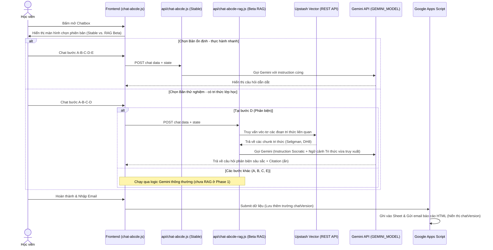

# Kế hoạch triển khai: Tích hợp RAG Beta cho Chatbox ABCDE Socratic (dh4hn-website)

Tài liệu này phác thảo kế hoạch nâng cấp kiến trúc của Chatbox thực hành Lạc quan ABCDE trên website Deliver Happiness, hỗ trợ chạy song song 2 phiên bản: **Bản ổn định - thực hành nhanh** (logic cũ) và **Bản thử nghiệm - có tri thức lớp học** (sử dụng RAG để tích hợp tri thức giảng dạy chuyên sâu).

---

## 👥 Quyết định kiến trúc đã thống nhất (Grill Answers)

Dựa trên kết quả phản hồi của sếp Vũ:
1. **Giao diện chọn phiên bản (Version Selector)**: Hiển thị màn hình chọn ngay khi mở Chatbox (người dùng chọn trước khi bắt đầu chat).
2. **Tên hiển thị**: 
   - Phiên bản cũ: `"Bản ổn định - thực hành nhanh"`
   - Phiên bản RAG mới: `"Bản thử nghiệm - có tri thức lớp học"`
3. **Trạng thái kích hoạt**: Bật kích hoạt công khai (public) ngay khi triển khai (`ABCDE_RAG_ENABLED=true`).
4. **Cơ chế xử lý khi lỗi**: Hiển thị thông báo lỗi thân thiện và gợi ý người dùng tự chuyển đổi thủ công sang bản ổn định.
5. **Thứ tự nạp tri thức (Ingestion)**: Ưu tiên nạp tài liệu của Martin Seligman trước, sau đó đến slide DH8 và transcript của audio `lac_quan_abcde.mp3` (phải chuyển âm thanh thành văn bản trước khi nạp). Đồng thời kết hợp tìm kiếm đầy đủ thông tin trong NotebookLM và Internet về ABCDE của tâm lý học tích cực.
6. **Lưu trữ dữ liệu**: Ghi nhận thuộc tính `chatVersion` vào cả Google Sheet CRM và email báo cáo HTML gửi cho học viên.
7. **Mức độ trích dẫn (Citation)**: Chỉ lưu vết trích dẫn ở nhật ký hệ thống (log) nội bộ của máy chủ (backend) phục vụ việc kiểm toán (audit), giữ giao diện trò chuyện sạch sẽ cho học viên.
8. **Phạm vi thử nghiệm (Beta Scope)**: Phase 1 chỉ áp dụng RAG cho bước D (Phản biện - Disputation) vì đây là bước phức tạp nhất, sau đó sẽ nâng cấp lên toàn bộ chu trình A-B-C-D-E ở phase 2.

---

## 🛠️ 1. Giải pháp kỹ thuật & Luồng xử lý (Technical Architecture)



### A. Thiết lập Schema cho Chunk Tri thức (Knowledge Chunk Schema)
Cơ sở dữ liệu véc-tơ (Vector Database) sử dụng **Upstash Vector** gọi qua REST API. Mỗi đoạn tài liệu (`chunk`) sẽ được lưu trữ với cấu trúc dữ liệu như sau:
```json
{
  "id": "chunk_uuid",
  "vector": [0.123, -0.456, "..."],
  "metadata": {
    "source_id": "doc_martin_seligman_01",
    "title": "Learned Optimism - Chapter 8",
    "source_type": "book | slide | audio_transcript | web_source",
    "lesson": "DHM8 | DHM9 | General",
    "abcde_step": "D",
    "chunk_id": 42,
    "source_hash": "sha256_hash_of_original_document",
    "version": "1.0.0",
    "citation": "Martin Seligman, Learned Optimism (Trang 145)",
    "text": "Nội dung văn bản thực tế dùng để đưa vào Prompt ngữ cảnh..."
  }
}
```

### B. Cơ chế bảo mật và An toàn thông tin
*   **Không lộ API Key**: Tuyệt đối không đưa API Key của Gemini hoặc Token truy cập Upstash Vector ra ngoài Frontend. Mọi cuộc gọi đến cơ sở dữ liệu véc-tơ và AI Studio đều được xử lý ngầm ở máy chủ qua endpoint Serverless của Vercel.
*   **Biến môi trường bảo mật**: Sử dụng tính năng Vercel Sensitive Environment Variables để lưu trữ:
    - `GEMINI_API_KEY`
    - `KV_REST_API_URL` / `KV_REST_API_TOKEN` (Upstash Redis Rate Limit)
    - `UPSTASH_VECTOR_REST_URL` / `UPSTASH_VECTOR_REST_TOKEN` (Upstash Vector DB)
    - `DHM8_APPS_SCRIPT_TOKEN` (Ký HMAC bảo mật Apps Script)

---

## 📂 2. Các tệp tin ảnh hưởng (Files Affected Allowlist)

Tất cả các thay đổi phải được giới hạn chính xác trong danh sách tệp tin sau:
*   `[MODIFY]` [chat-abcde.js](file:///C:/Users/vu.hoang/.gemini/antigravity/scratch/dh4hn-website/chat-abcde.js):
    - Thêm giao diện chọn phiên bản (version selector) ngay khi khởi tạo chatbox.
    - Xử lý lưu biến `chatVersion` cục bộ.
    - Xử lý fallback thủ công (hiển thị nút gợi ý chuyển về bản ổn định khi API RAG báo lỗi).
    - Truyền tham số `chatVersion` khi submit dữ liệu cuối cùng.
*   `[MODIFY]` [chat-abcde.css](file:///C:/Users/vu.hoang/.gemini/antigravity/scratch/dh4hn-website/chat-abcde.css):
    - Bổ sung định dạng CSS cho màn hình chọn phiên bản, nút chuyển đổi nhanh và thông báo lỗi thân thiện (đảm bảo scoped `.abcde-*`).
*   `[NEW]` [api/chat-abcde-rag.js](file:///C:/Users/vu.hoang/.gemini/antigravity/scratch/dh4hn-website/api/chat-abcde-rag.js):
    - Endpoint serverless mới dành riêng cho phiên bản Beta RAG.
    - Đọc kill switch `process.env.ABCDE_RAG_ENABLED`. Nếu `false`, tự động trả về lỗi để frontend gợi ý chuyển về stable.
    - Thực hiện truy vấn véc-tơ đến Upstash Vector REST API tại bước D để lấy tài liệu tri thức liên quan.
    - Gọi Gemini API với System Instruction nâng cấp kết hợp ngữ cảnh tri thức vừa tìm kiếm.
    - Ghi nhận `citation` vào log nội bộ.
*   `[MODIFY]` [Scripts/active_code_gs_final.js](file:///C:/Users/vu.hoang/.gemini/antigravity/scratch/dh4hn-website/Scripts/active_code_gs_final.js):
    - Cập nhật hàm `handleAbcdeSubmission` để tiếp nhận tham số `chatVersion`.
    - Ghi nhận `chatVersion` vào cột mới trong Sheet `ABCDE_Practice`.
    - Hiển thị thông tin phiên bản thực hành trong email HTML gửi về cho học viên.
*   `[NEW]` [Scripts/ingest_knowledge.py](file:///C:/Users/vu.hoang/.gemini/antigravity/scratch/dh4hn-website/Scripts/ingest_knowledge.py):
    - Script chạy thử nghiệm offline dùng để: chuyển đổi audio sang text (nếu có API/file), chia nhỏ văn bản (chunking), tạo embeddings và tải lên Upstash Vector DB.

---

## 📊 3. Ma trận kiểm thử UAT Matrix (Kiểm thử nghiệm thu)

| Mã TC | Kịch bản kiểm thử (Test Case) | Phương pháp thực hiện (Method) | Kết quả kỳ vọng (Expected Output) | Trạng thái (Status) |
| :--- | :--- | :--- | :--- | :--- |
| **TC-RAG-01** | Version Selection UI | Mở chatbox trên landing page | Hiện màn hình yêu cầu chọn phiên bản trước khi bắt đầu nhập liệu. | [UNVERIFIED] |
| **TC-RAG-02** | Stable Selection | Chọn bản Ổn định và thực hành | Hệ thống chạy mượt mà theo luồng cũ, gọi endpoint `api/chat-abcde.js`. | [UNVERIFIED] |
| **TC-RAG-03** | Beta RAG Selection | Chọn bản Thử nghiệm | Hệ thống kích hoạt phiên bản RAG, gọi endpoint `api/chat-abcde-rag.js`. | [UNVERIFIED] |
| **TC-RAG-04** | RAG Step D Activation | Chạy bản thử nghiệm đến bước D | Backend thực hiện truy vấn Upstash Vector thành công, Gemini trả về câu hỏi phản biện sâu dựa trên tri thức được nạp. | [UNVERIFIED] |
| **TC-RAG-05** | Kill Switch Off | Set `ABCDE_RAG_ENABLED=false` | Chọn bản thử nghiệm sẽ nhận lỗi thân thiện, gợi ý chuyển đổi về bản ổn định. Bản ổn định vẫn phải hoạt động bình thường. | [UNVERIFIED] |
| **TC-RAG-06** | Submit with chatVersion | Hoàn thành thực hành ở cả 2 bản | Dữ liệu ghi nhận vào Google Sheet có cột `chatVersion` ghi rõ tên bản đã dùng, email báo cáo hiển thị đúng phiên bản. | [UNVERIFIED] |
| **TC-RAG-07** | Security Audit | Kiểm tra Network panel trên trình duyệt | Không rò rỉ token Upstash Vector, API Key của Gemini hoặc bất kỳ thông tin nhạy cảm nào ra client. | [UNVERIFIED] |
| **TC-RAG-08** | Citation Logging | Kiểm tra log máy chủ của bản Beta | Log nội bộ ghi nhận chính xác các nguồn tài liệu đã được trích dẫn (citation) khi trả lời bước D. | [UNVERIFIED] |

---

## 🔒 4. Kế hoạch sao lưu & Quay lui (Rollback/Backup Plan)

*   **Sao lưu (Backup)**: Tạo bản sao lưu `.bak` cho các file `chat-abcde.js`, `chat-abcde.css` và `active_code_gs_final.js` trước khi thực hiện thay đổi.
*   **Quay lui (Rollback)**: Khôi phục lại từ các tệp `.bak` và tạm tắt biến môi trường `ABCDE_RAG_ENABLED=false` trên Vercel để vô hiệu hóa hoàn toàn endpoint Beta RAG trong trường hợp phát sinh lỗi nghiêm trọng.

---

## 🤝 5. Ranh giới phê duyệt (Approval Boundary)

*   **Duyệt kế hoạch (Consent Level 2)**: Sếp Vũ cần phản hồi bằng chữ "Approve", "Đồng ý", hoặc "OK" trực tiếp tại đây để phê duyệt kế hoạch triển khai chi tiết này trước khi em tiến hành cấu trúc thư mục và viết code.
*   **Duyệt tác vụ rủi ro cao (Consent Level 3)**: Trước khi chạy lệnh deploy lên Vercel production hoặc đẩy clasp push cập nhật Google Apps Script, em sẽ xin duyệt riêng cho từng câu lệnh cụ thể.

---

## 📝 6. Đánh giá tác động tài liệu (Docs Impact Gate)

*   **Docs touched**: `docs/abcde_chatbox_spec.md`, `Implementation Plan/implementation_plan_20260716_abcde_rag_beta.md`.
*   **Tác động tài liệu**: Cần cập nhật đặc tả kỹ thuật `abcde_chatbox_spec.md` để ghi nhận kiến trúc 2 phiên bản song song và mô tả chi tiết luồng dữ liệu của Upstash Vector DB.

---

## 📊 7. Bằng chứng định tuyến (Routing Evidence)

*   **Thư mục hiện hành (cwd):** `C:\Users\vu.hoang\.gemini\antigravity\scratch\Teaching DH`
*   **Dự án được xác định (resolved project):** `dh4hn-website`
*   **Đường dẫn lưu plan:** `C:\Users\vu.hoang\.gemini\antigravity\scratch\dh4hn-website\Implementation Plan\implementation_plan_20260716_abcde_rag_beta.md`
*   **Lý do:** Khởi tạo tài liệu lập kế hoạch trực tiếp tại thư mục dự án đích (`dh4hn-website`) nhằm đảm bảo tính nhất quán của source of truth lâu dài.
