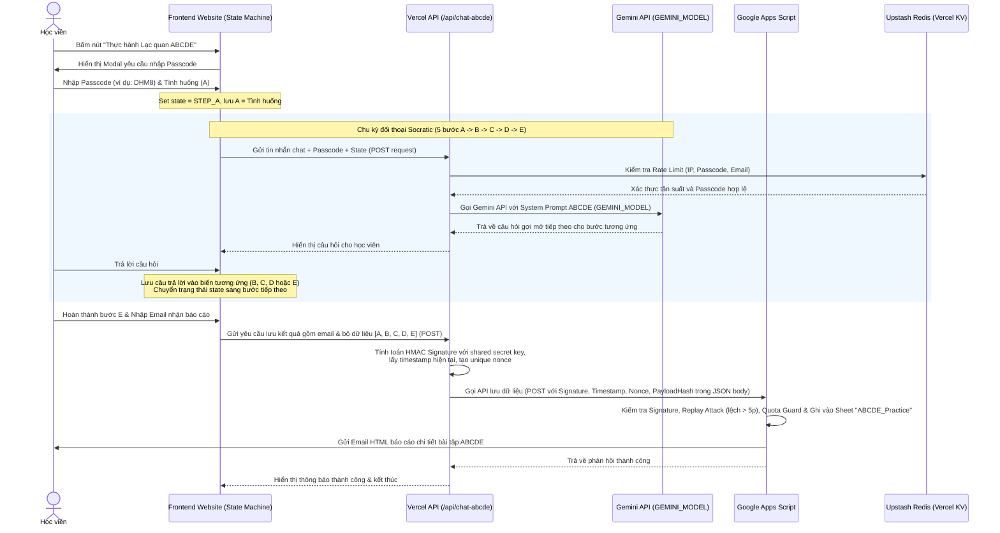

# Kế hoạch triển khai: Xây dựng Chatbox thực hành Lạc quan ABCDE (Socratic Dialogue)

Tài liệu này phác thảo giải pháp kiến trúc và kế hoạch triển khai công cụ Chatbox giúp học viên thực hành mô hình Lạc quan ABCDE theo phương pháp Socratic ngay trên trang chủ Deliver Happiness.

---

## 1. Kiến trúc & Giải pháp kỹ thuật

Mô hình kết nối và xử lý dữ liệu được thiết kế tối giản, bảo mật và tiết kiệm chi phí theo các quyết định từ buổi thảo luận (Brainstorming) và rà soát vòng 2 của Codex:

### A. Quản lý trạng thái bằng máy trạng thái Frontend (State Machine)
Để tránh tỷ lệ lỗi cao khi yêu cầu AI tự động định dạng dữ liệu "JSON ẩn" ở cuối cuộc trò chuyện, hệ thống sử dụng cơ chế quản lý trạng thái ngay tại Frontend JavaScript:
- **Các trạng thái**: `INIT` -> `STEP_A` -> `STEP_B` -> `STEP_C` -> `STEP_D` -> `STEP_E` -> `COMPLETED`.
- **Logic hoạt động**:
  - Giao diện chatbox ghi nhận trực tiếp câu trả lời của học viên cho từng bước và lưu vào đối tượng `currentPractice = { A: "", B: "", C: "", D: "", E: "" }`.
  - Frontend truyền trạng thái `state` hiện tại lên Vercel API. Chỉ dẫn hệ thống (`System Instruction`) của AI sẽ dựa trên trạng thái này để tập trung hỏi hoặc gợi ý phản biện đúng bước tương ứng.
  - Khi học viên kết thúc bước E, Frontend đã có đủ dữ liệu sạch `[A, B, C, D, E]` để thực hiện submit.

### B. Giải pháp Bảo mật & Rate Limiting
*   **Cấu hình Model**: Sử dụng biến môi trường **`process.env.GEMINI_MODEL`** (mặc định cấu hình `gemini-2.5-flash` có ngày dừng hoạt động là 16/10/2026; model thay thế dự kiến sau đó là `gemini-3.5-flash`).
*   **Bảo mật API Key**: Lưu trong biến môi trường của Vercel (`process.env.GEMINI_API_KEY`), tuyệt đối không lộ ở client.
*   **Rate Limiting bền vững**: Tích hợp **`Upstash Redis` (Vercel KV)** bằng REST API siêu nhẹ:
    - Giới hạn IP: Tối đa 20 requests/phút.
    - Giới hạn Passcode: Tối đa 100 requests/phút (chống brute-force passcode).
    - Giới hạn Session/Email: Tối đa 50 requests/ngày.
    - Body Size Limit: Chặn request có payload > 10KB.
    - Origin Allowlist: Chỉ cho phép yêu cầu từ domain Deliver Happiness chính thức.

### C. Bảo mật Google Apps Script (JSON Body Signature)
*   **Khắc phục giới hạn Apps Script**: Do Google Apps Script Web App không hỗ trợ đọc các Custom HTTP Headers, chữ ký bảo mật sẽ được truyền trực tiếp trong **JSON body** của POST request.
*   **Cơ chế ký bảo mật (HMAC Signature)**:
    - Payload gửi sang Apps Script bao gồm: `action: "submit_abcde"`, `timestamp` (thời gian Unix), `nonce` (chuỗi ngẫu nhiên dùng một lần), `payloadHash` (mã băm sha256 của cục dữ liệu A-B-C-D-E), và `signature` (chữ ký HMAC-SHA256 được tạo bằng shared secret key `DHM8_APPS_SCRIPT_TOKEN`).
    - Apps Script ở đầu nhận sẽ tính toán lại signature, đồng thời kiểm tra `timestamp` (từ chối nếu lệch quá 5 phút để chống replay attacks) và kiểm tra `nonce` để ngăn trùng lặp.
*   **Bảo mật Apps Script (`active_code_gs_final.js`)**:
    - Kiểm tra `kill switch`: Property `KILL_SWITCH_ABCDE === "true"` sẽ dừng ngay lập tức.
    - Kiểm tra `quota guard`: Giới hạn tối đa ghi nhận 100 bài thực hành và gửi tối đa 100 email mỗi ngày để tránh cạn kiệt quota Gmail của sếp.
    - Ghi dữ liệu vào Google Sheet `ABCDE_Practice` với các cột: `Timestamp`, `Full Name`, `Email`, `Adversity (A)`, `Belief (B)`, `Consequence (C)`, `Disputation (D)`, `Energization (E)`, `Passcode`.

### D. Quy định scoped CSS & Tránh xung đột UI
*   Mọi class CSS trong `chat-abcde.css` phải được scoped bằng tiền tố `.abcde-*`.
*   Nút kích hoạt trên trang chủ sử dụng ID `#btn-abcde-chat` độc nhất.
*   Khung chat Modal được tạo động bằng Javascript và append thẳng vào `document.body` với `z-index: 10000` (cao hơn thanh top-nav hiện tại là 9999).
*   Không ghi đè lên các tag toàn cục của trình duyệt.

---

## 2. Các tệp tin ảnh hưởng (Files Affected Allowlist)

Tất cả các thay đổi phải được giới hạn chính xác trong danh sách tệp tin sau:
*   `[MODIFY]` [index.html](file:///C:/Users/vu.hoang/.gemini/antigravity/scratch/dh4hn-website/index.html): Tích hợp nút bấm và link stylesheet/js mới.
*   `[NEW]` [chat-abcde.js](file:///C:/Users/vu.hoang/.gemini/antigravity/scratch/dh4hn-website/chat-abcde.js): Logic điều khiển UI Chatbox, đối thoại và gửi kết quả POST về backend.
*   `[NEW]` [chat-abcde.css](file:///C:/Users/vu.hoang/.gemini/antigravity/scratch/dh4hn-website/chat-abcde.css): Stylesheet cho chatbox với prefix `.abcde-*`.
*   `[NEW]` [api/chat-abcde.js](file:///C:/Users/vu.hoang/.gemini/antigravity/scratch/dh4hn-website/api/chat-abcde.js): Vercel Serverless Function gọi Gemini API và chuyển tiếp kết quả ký HMAC đến Google Apps Script.
*   `[MODIFY]` [Scripts/active_code_gs_final.js](file:///C:/Users/vu.hoang/.gemini/antigravity/scratch/dh4hn-website/Scripts/active_code_gs_final.js): Bổ sung hàm `handleAbcdeSubmission(body)` kiểm tra signature, replay attack, quota guard, ghi nhận thông tin ABCDE vào Google Sheet và gửi email báo cáo HTML.

---

## 3. Ma trận kiểm thử UAT Matrix (Kiểm thử nghiệm thu)

Báo cáo UAT bắt buộc phải bao gồm và đi qua đầy đủ các test cases dưới đây:

| Mã TC | Kịch bản kiểm thử (Test Case) | Phương pháp thực hiện (Method) | Kết quả kỳ vọng (Expected Output) | Trạng thái (Status) |
| :--- | :--- | :--- | :--- | :--- |
| **TC-01** | Wrong Passcode | Mở chatbox, nhập mã "WRONG" | Giao diện hiển thị cảnh báo lỗi và chặn không cho chat. | [UNVERIFIED] |
| **TC-02** | Right Passcode | Mở chatbox, nhập mã "DHM8" | Mở thành công và bắt đầu bước 1 (mô tả tình huống A). | [UNVERIFIED] |
| **TC-03** | State Machine & Dialogue | Đi qua chu kỳ đối thoại 5 bước | State machine Frontend lưu chính xác A, B, C, D, E vào đối tượng tạm qua từng bước chat. | [UNVERIFIED] |
| **TC-04** | Rate limit 429 | Gửi > 20 requests liên tục trong 1 phút | Backend trả về mã lỗi HTTP 429 và hiển thị thông báo chờ. | [UNVERIFIED] |
| **TC-05** | Missing API Key | Ẩn/Xóa GEMINI_API_KEY ở backend local | Backend trả về lỗi 500 an toàn, không hiển thị log lỗi ra ngoài client. | [UNVERIFIED] |
| **TC-06** | Upstream Error | Giả lập lỗi API Gemini trả về 429/timeout | Hiển thị thông báo lỗi kết nối thân thiện, cho phép gửi lại tin nhắn cũ. | [UNVERIFIED] |
| **TC-07** | Schema Validation | Nhập email sai định dạng | Chặn ở cả frontend và backend, hiển thị thông báo email không hợp lệ. | [UNVERIFIED] |
| **TC-08** | Visual Check | Mở chatbox trên desktop và mobile | Giao diện responsive mượt mà, không vỡ layout, z-index hiển thị đúng. | [UNVERIFIED] |
| **TC-09** | Security Audit | Kiểm tra Console & Network panel | Không rò rỉ API key, URL Google Apps Script và các thông tin nhạy cảm. | [UNVERIFIED] |
| **TC-10** | Signature Validation | Giả lập gửi request sai signature/replay | Apps Script từ chối xử lý, trả về lỗi chữ ký không hợp lệ/replay attack. | [UNVERIFIED] |
| **TC-11** | Sheet Record | Kiểm tra Google Sheet sau khi submit | Dòng dữ liệu mới được ghi nhận đầy đủ thông tin A-B-C-D-E vào Sheet. | [UNVERIFIED] |
| **TC-12** | Email Delivery | Kiểm tra hòm thư của học viên test | Nhận được email báo cáo định dạng HTML đẹp mắt, đầy đủ nội dung. | [UNVERIFIED] |
| **TC-13** | Regression Test | Probe HTTP trực tiếp 6 URLs live | Cả 6 URL live cốt lõi (/, /assessment.html, /register.html, /register_direct.html, /register-test.html, /dh8/) hoạt động bình thường. | [UNVERIFIED] |

---

## 4. Ma Trận Kiểm Chứng Bề Mặt (Surface Verification Matrix)

*Theo quy chuẩn AGENT_REPORTING_RULES.md của dự án:*

| Bề mặt kiểm chứng (Verification Surface) | Phương pháp kiểm chứng (Method) | Kết quả kỳ vọng (Expected Output) | Trạng thái (Status) |
| :--- | :--- | :--- | :--- |
| **Local files** | Grep trong allowlist logic | Các file logic cục bộ không chứa thông tin ngày cũ | [UNVERIFIED] |
| **Apps Script deployment** | Clasp push & status | Phiên bản deploy hoạt động chính xác | [UNVERIFIED] |
| **Public frontend URLs** | Probe HTTP trực tiếp 6 URLs live | Trả về nội dung ngày và event_id mới | [UNVERIFIED] |
| **Browser evidence** | Ảnh chụp UI live thực tế | Giao diện hiển thị chính xác | [UNVERIFIED] |
| **Final verdict** | Đối chiếu toàn diện ma trận | Tất cả bề mặt đều PASS | [UNVERIFIED] |

---

## 5. Kế hoạch sao lưu & Quay lui (Rollback/Backup Plan)

*   **Sao lưu (Backup)**: Sao lưu các tệp `index.html` và `active_code_gs_final.js` thành các bản `.bak` trước khi sửa đổi.
*   **Quay lui (Rollback)**: Khôi phục lại từ các tệp `.bak` và xóa các tệp mới tạo trong trường hợp có lỗi nghiêm trọng làm gián đoạn trang web.

---

## 6. Ranh giới phê duyệt (Approval Boundary)

*   **Duyệt kế hoạch (Consent Level 2)**: Sếp Vũ cần gõ "Approve", "Đồng ý", hoặc "OK" để phê duyệt kế hoạch triển khai chi tiết này trước khi tôi bắt đầu viết code.
*   **Duyệt Deploy / clasp push (Consent Level 3)**: Trước khi chạy lệnh deploy lên Vercel production hoặc thực hiện `clasp push` cập nhật Apps Script thật, tôi sẽ xin duyệt riêng cho từng câu lệnh cụ thể.

---

## 7. Đánh giá tác động tài liệu (Docs Impact Gate)

*   **Docs touched**: `Implementation Plan/implementation_plan.md`, `docs/system-architecture.md`, `docs/deployment-guide.md`
*   **Tác động tài liệu**: Cần cập nhật lại hai tài liệu kiến trúc hệ thống và hướng dẫn triển khai để mô tả chính xác kết nối bảo mật HMAC trong body và sơ đồ máy trạng thái.
*   **Docs impact**: docs update required cho `docs/system-architecture.md` và `docs/deployment-guide.md` trước khi claim completion.

---

## 8. Bằng chứng định tuyến (Routing Evidence)

*   **Thư mục hiện hành (cwd):** `C:\Users\vu.hoang\.gemini\antigravity\scratch\Teaching DH`
*   **Dự án được xác định (resolved project):** `dh4hn-website`
*   **Đường dẫn gốc (original path):** `C:\Users\vu.hoang\.gemini\antigravity\brain\62e0386b-337b-46cd-9f44-89824a5606dc\implementation_plan.md`
*   **Đường dẫn sao lưu (mirrored path):** `C:\Users\vu.hoang\.gemini\antigravity\scratch\dh4hn-website\Implementation Plan\implementation_plan.md`
*   **Thời gian sao lưu (mirror time):** `2026-07-15T17:15:00+07:00`
*   **Lý do (reason):** Đồng bộ hóa tài liệu lập kế hoạch về thư mục dự án chịu tác động chính (dh4hn-website) để làm nguồn chuẩn tham chiếu lâu dài (long-term source of truth).
