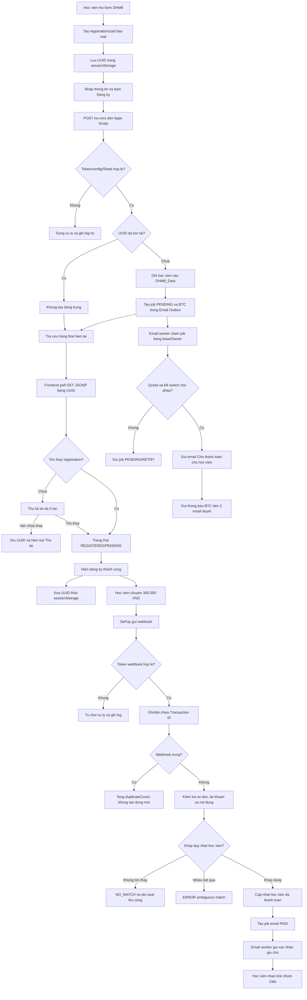
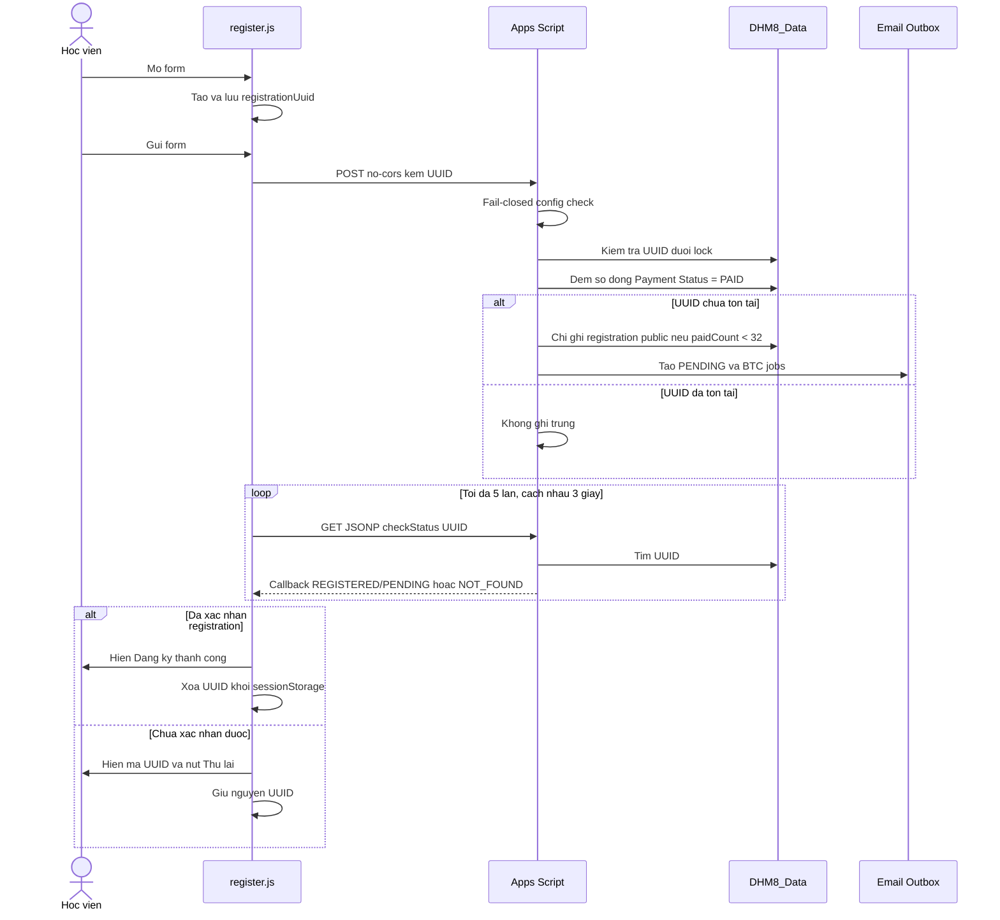
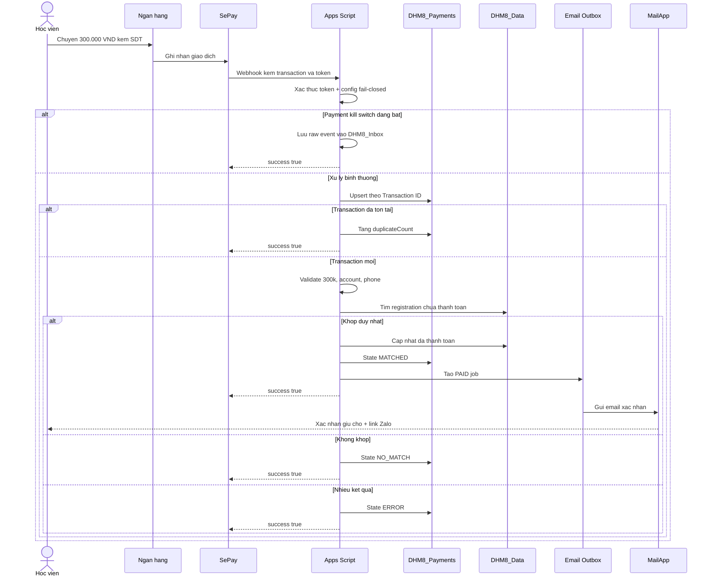
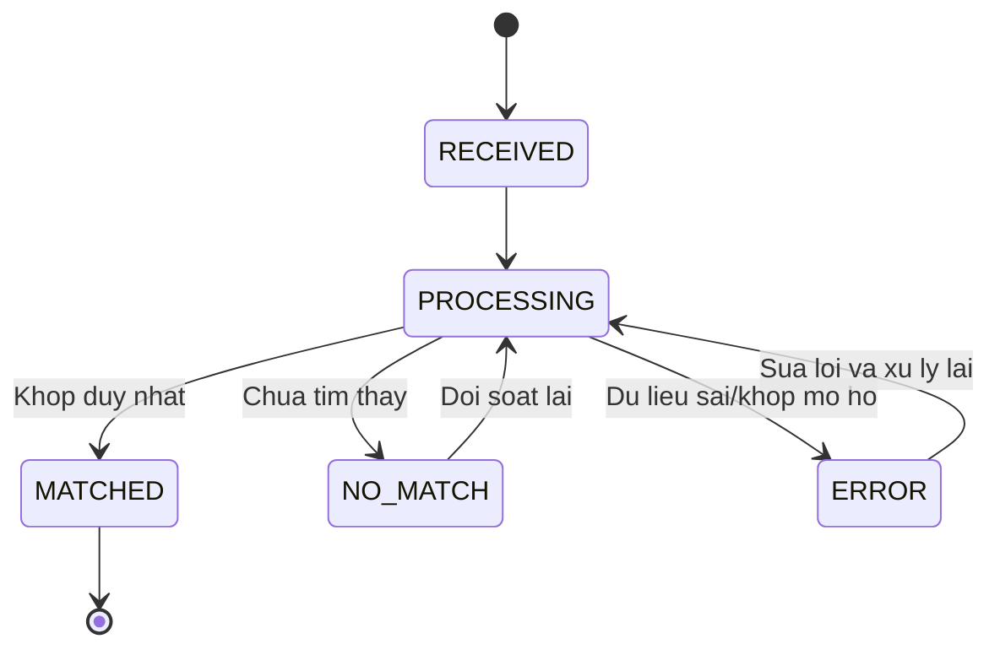
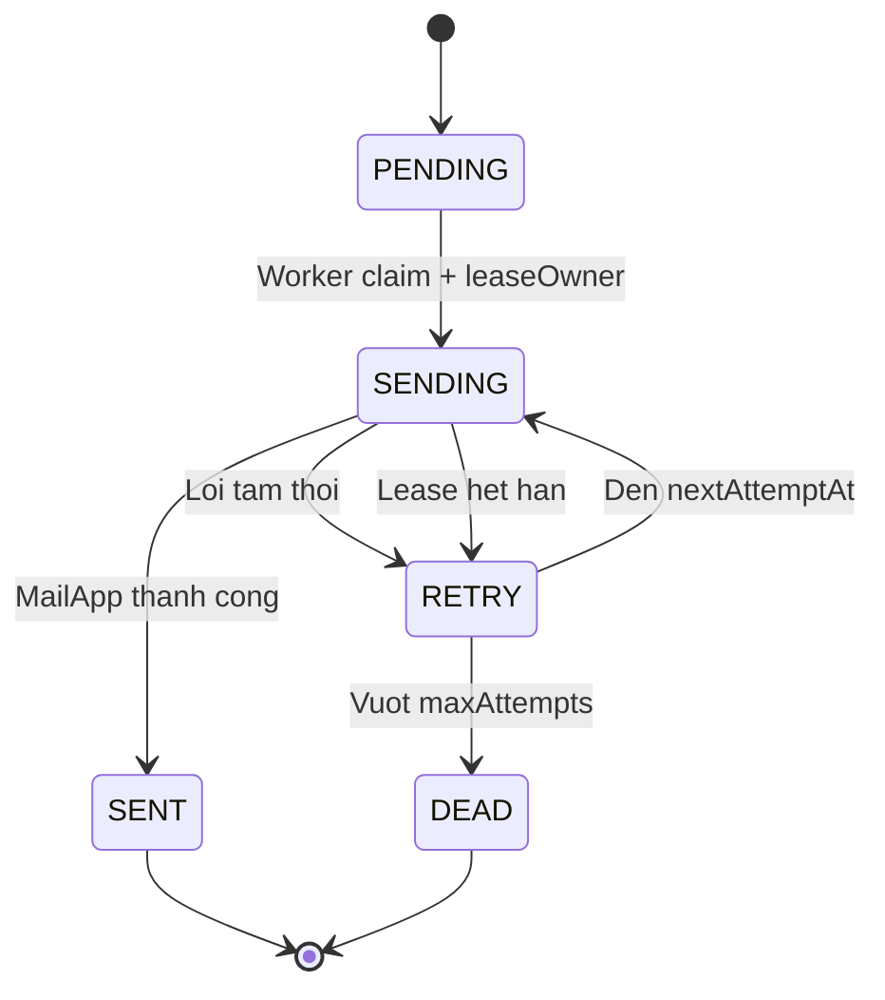

# Workflow Dang Ky Va Thanh Toan DHM8

Ngay cap nhat: 2026-07-09

Tai lieu nay mo ta thiet ke du kien trong:

- `Implementation Plan/gemini_20260616_HardenDHM8EmailAutomation.md`
- `Implementation Plan/codex_20260616_Gate1Approval.md`

Day la workflow thiet ke cho Gate 1, chua phai bang chung he thong live da chay
theo luong nay.

## 1. Tong Quan End-to-End

## 2. Trinh Tu Dang Ky Va Xac Nhan

## 3. Trinh Tu Thanh Toan SePay

## 4. Vong Doi Trang Thai

### Payment

### Email Outbox

## 5. Cac Cong Kiem Tra Bat Buoc

- UUID phai tao bang `crypto.randomUUID()` hoac `crypto.getRandomValues()`.
- Chi hien dang ky thanh cong sau khi JSONP xac nhan UUID co trong `DHM8_Data`.
- Si so cong bo cua DHM8 van la 40. Nguong van hanh tam thoi cua cong dang ky
  public la `paidCount >= 32`; 8 hoc vien con lai duoc import sau theo quy trinh
  rieng. `paidCount` la so dong `DHM8_Data` co `Payment Status = PAID`; khong
  dong theo tong so dong dang ky PENDING.
- `checkRegistrationAvailability` phai tra `countBasis: "PAID"`, `paidCount`,
  `dataRowCount`, `cap`, va `registrationOpen` de de audit.
- Viec dong cong chi chan dang ky moi. Luong resume/checkStatus va thanh toan
  cua registration da ton tai van tiep tuc hoat dong.
- `getSpreadsheet()` phai fail-closed, khong fallback sang active spreadsheet.
- Webhook SePay phai xac thuc token truoc khi xu ly giao dich.
- Giao dich chi auto-match khi dung 300.000 VND va co dung mot hoc vien phu hop.
- Job email duoc cap nhat theo `jobKey` va `leaseOwner`.
- Email BTC chi gui den `chauhm71@gmail.com` va `vuhoang2708@gmail.com`.
- Moi staging, trigger, Sheet mutation va deploy deu can phe duyet rieng.

## 6. Bang Chung Can Co Truoc Khi Len Production

- Static/mock test output cho UUID, JSONP injection, duplicate POST va webhook.
- Browser evidence tai `UAT/dhm8_browser_evidence_20260616/`.
- UAT report tai `UAT/dhm8_email_uat_report_20260616.md`.
- Diff chinh xac cua frontend, final Apps Script va rollback Apps Script.
- Backup code va Sheet truoc cutover.
- Xac minh URL webhook SePay van giu nguyen sau deploy.
