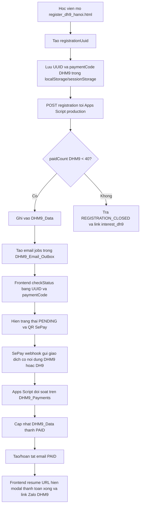

# Workflow dang ky va thanh toan DHM9

Ngay cap nhat: 2026-07-09

Tai lieu nay la `source of truth` (nguon chuan de cac agent cung tham chieu)
cho luong DHM9 Ha Noi sau production finish ngay 2026-07-02.

Bang chung chinh:

- `Implementation Plan/codex_20260701_DHM9AppsScriptProductionDeployPlan.md`
- `Implementation Plan/codex_20260701_DHM9FullCircleProductionE2EPlan.md`
- `UAT/codex_20260701_DHM9AppsScriptProductionDeploy.md`
- `UAT/codex_20260701_DHM9FullCircleProductionE2E.md`
- `UAT/gemini_20260701_DHM9_full_circle_browser_round2.md`
- `UAT/dhm9_production_finish_full_circle_20260702.md`
- `Artifacts/dhm9_full_circle_e2e/codex_dhm9_browser_full_circle_20260702_013933.json`
- `UAT/dhm9_gmail_inbox_search_20260702_013933.json`

## 1. Trang thai production hien tai

`VERIFIED`: Google Apps Script production deployment dang dung:

```text
Script ID: 1qzwACGvT12j7rxoSW3w4OwpX5rt87Heh4CEA1qT85HJbTYe1yam6dwNS
Deployment ID: AKfycbw0vTBMod1rp4f_906BcjwXbPhlb9ltiDiwVPdaOg4fOWZZOlpmy7jp2fOSrETQQe9PZQ
Deployment version: @51 - DHM9 production finish UX async email 20260702
Web App URL: https://script.google.com/macros/s/AKfycbw0vTBMod1rp4f_906BcjwXbPhlb9ltiDiwVPdaOg4fOWZZOlpmy7jp2fOSrETQQe9PZQ/exec
```

`VERIFIED`: frontend live chinh cho DHM9 la:

```text
https://delivering-happiness.vercel.app/register_dh9_hanoi.html
```

`VERIFIED`: form DHM9 dung `event_id`:

```text
DHM9_REG_220826_HN
```

`VERIFIED`: frontend live dang co hai hotfix production finish:

```text
692fe42 fix(dhm9): use jsonp status checks by default
7229b7b fix(dhm9): prevent realtime phone check blocking submit
Latest pushed evidence commit: bee3da9 test(dhm9): add production finish screenshots
```

## 2. Quyen so huu va lane key

Google Apps Script van dung mot codebase chung cho DHM8 va DHM9. Viec tach lop
duoc thuc hien bang `lane key` (khoa phan luong lop) va tien to ma thanh toan.

| Lop | Lane canonical | Alias duoc chap nhan | Tien to thanh toan canonical | Tien to legacy duoc chap nhan |
| :--- | :--- | :--- | :--- | :--- |
| DHM8 HCM | `dh8` | `dh8` | `DH8` | N/A |
| DHM9 Ha Noi | `dh9` | `dhm9`, `dh9` | `DHM9` | `DH9` |

Quy tac van hanh:

- Ma thanh toan moi cua DHM9 phai sinh theo tien to `DHM9`.
- Backend phai tiep tuc nhan `DH9` de tuong thich nguoc voi giao dich cu.
- `detectLaneKeyFromPaymentCode_(paymentCode)` va
  `detectLaneKeyFromPayload_(data)` phai nhan song song `DHM9` va `DH9`.
- DHM8 khong duoc nhin thay registration DHM9 khi truy van `lane=dh8`.

## 3. Sheet mapping

`INFERRED from code`: DHM9 dung cac sheet rieng ben duoi trong cung Google
Spreadsheet (bang tinh Google):

| Muc dich | Sheet |
| :--- | :--- |
| Registration data | `DHM9_Data` |
| Payment ledger | `DHM9_Payments` |
| Email outbox | `DHM9_Email_Outbox` |
| Raw webhook inbox | `DHM9_Inbox` |
| Interest leads | `DHM9 interest` |

`VERIFIED by UAT`: lane `dhm9` va `dh9` deu tro ve trang quan tam DHM9, con
lane `dh8` van tro ve trang DHM8.

## 4. Luong dang ky end-to-end



## 4.1 Rule dong cong dang ky

`VERIFIED from local source 2026-07-09`: cong dang ky DHM9 dung chung backend
Apps Script voi DHM8 va dong theo `paidCount`, khong dong theo tong so dong
dang ky.

- `paidCount` la so dong trong `DHM9_Data` co `Payment Status = PAID`.
- Cong dang ky moi dong khi `paidCount >= 40`.
- `checkRegistrationAvailability?lane=dh9` phai tra `countBasis: "PAID"`,
  `paidCount`, `dataRowCount`, `cap`, va `registrationOpen`.
- Viec dong cong chi chan dang ky moi. Luong resume/checkStatus va thanh toan
  cua registration da ton tai van tiep tuc hoat dong.

## 5. Dieu kien doi soat SePay

`VERIFIED by E2E`: luong full-circle (kiem thu dau-cuoi) production da chay voi
giao dich gia lap SePay moi nhat ngay 2026-07-02:

```text
Registration UUID: 9ed7cdc0-80d6-4f5d-b7f4-7f4eef01fcc2
Payment code: DHM9931173905
Fake SePay transaction ID: codex-dhm9-browser-e2e-20260702_013933
Amount: 250000
Recipient test email: vuhoang2708@gmail.com
```

Ket qua:

- `VERIFIED`: registration duoc tao thanh cong, ban dau `paymentStatus=PENDING`.
- `VERIFIED`: webhook SePay gia lap tra `success=true`.
- `VERIFIED`: sau webhook, `checkStatus` tra `paymentStatus=PAID`.
- `VERIFIED`: valid callback follow-up tra `success=true`, `state=REGISTERED`,
  va `paymentStatus=PAID`.
- `VERIFIED`: browser resume URL hien `Da thanh toan`.
- `VERIFIED`: nut `Dang ky nguoi khac` xuat hien tren success surface.
- `VERIFIED`: Gmail inbox search tim thay evidence theo payment code, full name,
  va registration UUID.
- `INFERRED`: DHM8 khong bi anh huong vi finish commits chi cham `register_dh9.js`
  va evidence UAT; khong stage file Apps Script DHM8 archive.

## 6. Bang chung browser va inbox

`VERIFIED`: Codex da chay browser tren live production voi resume URL gom
`uuid` va `paymentCode`, o viewport desktop va mobile.

Evidence:

```text
UAT/dhm9_production_finish_full_circle_20260702.md
UAT/dhm9_browser_live_uat_20260702.json
UAT/screenshots/dhm9_production_finish_20260702/codex_desktop_initial.png
UAT/screenshots/dhm9_production_finish_20260702/codex_mobile_initial.png
UAT/screenshots/dhm9_production_finish_20260702/codex_e2e_pending_20260702_013933.png
UAT/screenshots/dhm9_production_finish_20260702/codex_e2e_paid_resume_20260702_013933.png
UAT/dhm9_gmail_inbox_search_20260702_013933.json
```

Ket qua browser:

- Resume URL load thanh cong.
- Trang live hien status "Da thanh toan".
- Ma thanh toan hien thi bat dau bang `DHM9`.
- Static browser UAT khong co fatal console error.
- Workspace MCP Gmail search xac thuc co email lien quan trong inbox test.

## 7. Guardrails van hanh

- Khong chay lai webhook SePay production neu chua co phe duyet truc tiep cua
  user, vi moi transaction ID moi se tao tac dong that len sheet production.
- Neu can test full-circle lan nua, phai dung email test do user chi dinh, transaction
  ID doc nhat, va bao cao raw artifact vao `Artifacts/`.
- Khong in token webhook, account number day du, hoac thong tin nhay cam vao report.
- Khong claim `Live done` (da xong tren moi truong public) neu chua co browser
  evidence va/hoac UAT report trong repo.
- Khong doi tien to frontend sang gia tri moi neu backend chua deploy va chua
  co read-only probe xac thuc lane routing.

## 8. Checklist truoc khi commit/push/deploy lien quan DHM9

- `git status --short --branch` da duoc doi chieu va tach file safe/unsafe.
- `git diff --check` khong bao whitespace error tren files duoc sua.
- Frontend sinh ma thanh toan canonical `DHM9`.
- Backend chap nhan ca `DHM9` va `DH9`.
- `checkStatus` voi `lane=dh8` khong thay registration DHM9.
- `checkRegistrationAvailability?lane=dh9` phai dung `countBasis: "PAID"` va
  dong cong theo `paidCount >= 40`, khong theo tong so dong `DHM9_Data`.
- Browser UAT co desktop/mobile screenshot.
- Neu co Apps Script deploy, phai ghi version deployment va backup path vao UAT.
