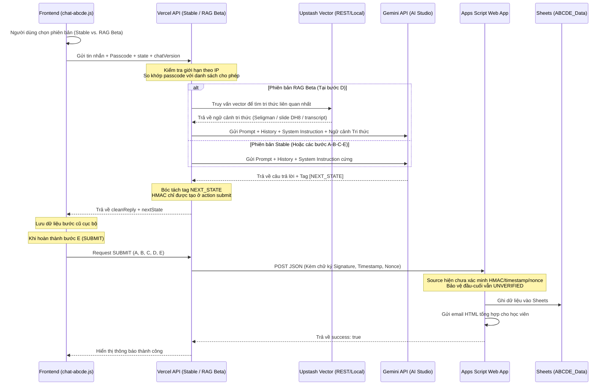

# 🧠 ĐẶC TẢ KỸ THUẬT CHATBOX ABCDE SOCRATIC (ABCDE SOCRATIC CHATBOX SPECIFICATION)

Tài liệu này mô tả chi tiết giải pháp kỹ thuật, kiến trúc hệ thống, quy tắc điều khiển trạng thái nhận thức và cơ chế bảo mật của Chatbox thực hành Lạc quan ABCDE theo phương pháp Socratic trong chương trình Delivering Happiness.

---

## 🛠️ 1. Kiến trúc Hệ thống & Luồng Dữ liệu (System Architecture)

Hệ thống được thiết kế theo mô hình **AI-driven State Control** (AI điều khiển trạng thái) kết hợp xác thực bảo mật nhiều lớp từ Frontend đến CRM Google Sheets qua API Vercel Serverless.

### Các thành phần chính:
1.  **Frontend (`chat-abcde.js` & `chat-abcde.css`)**: 
    - Nhúng trực tiếp vào Landing Page bằng mã HTML tĩnh. Giao diện thiết kế theo ngôn ngữ hiện đại (Glassmorphism), đáp ứng tốt trên cả máy tính (Desktop) và điện thoại (Mobile).
    - Quản lý máy trạng thái cục bộ và lưu trữ tạm thời các câu trả lời của học viên qua từng bước.
2.  **Vercel Serverless Function API (`api/chat-abcde.js`)**:
    - Làm nhiệm vụ API Gateway trung gian kết nối sang Gemini API.
    - Tích hợp giới hạn theo IP, tối đa 20 request/phút; ưu tiên Upstash Redis và dự phòng bằng bộ nhớ tiến trình.
    - Giữ Gemini API key ở môi trường server. Riêng submit ABCDE vẫn còn fallback cấu hình trong source, nên không được claim secret handling đã hoàn tất.
3.  **Google Apps Script Web App (`active_code_gs_final.js`)**:
    - Nhận payload thực hành cuối cùng do Vercel API gửi sang.
    - Lưu dữ liệu vào bảng tính Google Sheets CRM `ABCDE_Data` và gọi luồng email báo cáo HTML. Apps Script hiện chưa xác minh chữ ký HMAC do Vercel gửi kèm.

### 4. Giao diện Thực hành Tĩnh (`practice-abcde.html` - Interactive Worksheet)
    - Luồng thực hành độc lập tải dữ liệu JSON tĩnh chứa 18 case studies.
    - Dùng cho học viên muốn luyện tập nhanh bằng cách điền trực tiếp qua lưới đối chiếu (Side-by-Side Grid).
    - Frontend sử dụng Regex để bóc tách gợi ý mẫu thành các khối B, C, D, E tương ứng.

---

## 🧠 2. Quy tắc Nhận thức & Logic dẫn dắt Socratic (Cognitive Logic & Socratic Guidance)

### A. Bộ lọc Camera Khách quan ở Bước A (Objectivity Filter - Eliminating Victim Mentality)
*   **Vấn đề nhận thức**: Học viên thường có xu hướng trộn lẫn sự phán xét chủ quan, đổ lỗi hoặc mang **tâm lý nạn nhân** (`victim mentality`) vào Nghịch cảnh (A). Sự bóp méo này khiến họ cảm thấy bế tắc và không thể phản biện hiệu quả ở bước D.
*   **Giải pháp xử lý**:
    - AI ở Backend đóng vai trò bộ lọc camera khách quan 100% (chỉ ghi nhận sự thật vật lý).
    - Nếu phát hiện học viên trộn phán xét/suy diễn vào A, AI sẽ chỉ ra một cách thấu cảm và **chủ động gợi ý họ tạm "để dành" suy nghĩ tiêu cực đó cho bước B (Belief)**.
    - AI trả về tag ẩn `[NEXT_STATE: STEP_A]` để giữ học viên lại bước này.
    - Chỉ khi học viên mô tả được A một cách khách quan, trung tính, AI mới trả về `[NEXT_STATE: STEP_B]` để Frontend cho phép chuyển bước.

### B. Tinh lọc Socratic & Kích hoạt Tự nhận diện ở Bước B (Socratic Extraction & Attribution Style Analysis)
*   **Rào cản nhận thức**: Học viên rất khó tự nhận diện và gọi tên chính xác **Niềm tin tiêu cực tự động** (`Automatic Negative Thoughts` - ANT).
*   **Giải pháp xử lý (Chiến lược gợi mở 3 hướng của AI)**:
    - **Sử dụng chất liệu "để dành" từ bước A (Quan trọng)**: AI chủ động quét lại lịch sử hội thoại, trích xuất chính xác những suy diễn, đổ lỗi cảm tính mà học viên đã lỡ viết ra ở bước A (nhưng bị AI lọc và yêu cầu "để dành") để làm chất liệu xuất phát điểm cho bước B. Việc này giúp tối ưu hóa ngữ cảnh và chứng minh mối quan hệ giữa A và B trực quan cho học viên.
    - AI kiên trì đối thoại ít nhất 1-2 lượt bằng cách xoay vòng qua 3 hướng tiếp cận Socratic để bóc tách niềm tin cốt lõi:
        1. **Truy vấn Suy nghĩ tức thời (Immediate Thought)**.
        2. **Khai thác Phong cách Quy kết (Attribution Style)**.
        3. **Bóc tách Sự phóng đại tiêu cực (Catastrophizing)**.
*   **Chuyển bước**: AI sẽ giữ tag `[NEXT_STATE: STEP_B]` để gạn lọc. Chỉ khi học viên gọi tên rõ ràng được niềm tin cốt lõi, AI mới tóm tắt xác nhận và trả về tag `[NEXT_STATE: STEP_C]` để chuyển trạng thái.

### C. Gắn kết Hệ quả Nhận thức ở Bước C (Consequence - Connecting B & C)
*   **Vấn đề nhận thức**: Học viên thường lầm tưởng cảm xúc đau khổ (C) của họ sinh ra trực tiếp bởi Nghịch cảnh khách quan (A).
*   **Giải pháp xử lý**: AI làm rõ mối quan hệ nhân quả: chính Niềm tin B tạo ra Hệ quả C chứ không phải nghịch cảnh A. AI yêu cầu học viên chỉ rõ cảm xúc tiêu cực và hành vi phản ứng tự động xuất hiện. Trả về tag `[NEXT_STATE: STEP_D]` khi hoàn tất.

### D. Vòng lặp Tự đánh giá Nhận thức ở Bước D (Cognitive Validation Loop)
*   **Vấn đề nhận thức**: Phản biện tư duy (`Disputation` - D) là bước khó nhất.
*   **Giải pháp xử lý**:
    - Cuộc đối thoại phản biện ở bước D diễn ra theo cụm 2 lượt.
    - Sau mỗi lượt chẵn, Frontend hiển thị 2 nút phản hồi nhanh:
        *   `Đã hiệu quả, đi tiếp` 🟢: Frontend gán `currentState = "STEP_E"`.
        *   `Tôi muốn phản biện thêm` 🟡: Frontend giữ nguyên `currentState = "STEP_D"`, AI tiếp tục hỏi sâu về các khía cạnh (Utility, Implications).

### E. Energization — Năng lượng mới được khơi dậy ở Bước E
*   **Định nghĩa học thuật**: "Energization" (Seligman, 1990) là trạng thái cảm xúc tích cực, cảm giác nhẹ nhõm và năng lượng mới sinh ra sau khi phản biện (Dispute) thành công niềm tin tiêu cực. Đây là trạng thái tâm lý, không đồng nghĩa với hành động vật chất bắt buộc.
*   **Mục tiêu**: Giúp học viên nhận diện và gọi tên trạng thái Energization, từ đó mở ra khả năng tiếp cận lại Nghịch cảnh A theo explanatory style (phong cách diễn giải) mới.
*   **Giải pháp xử lý** (luồng 2 câu hỏi nối tiếp trong cùng 1 state STEP_E):
    - **Câu hỏi 1 — Nhận diện Energization**: AI hỏi về cảm xúc/năng lượng mới: *"Bạn cảm thấy thế nào sau khi đã bẻ gãy được suy nghĩ tiêu cực đó?"*
    - **Câu hỏi 2 — Tiếp cận lại A**: Sau đó AI hỏi tiếp: *"Từ năng lượng và góc nhìn mới này, bạn nghĩ mình có thể tiếp cận lại nghịch cảnh A theo những hướng nào?"*
    - **Nguyên tắc quan trọng**: AI không phán xét loại câu trả lời. Hành động vật chất cụ thể và thay đổi nhận thức/chấp nhận đều là cách "tiếp cận lại A" hợp lệ theo đúng tinh thần Seligman.
    - Khi nhận câu trả lời cho bước E, AI trả về `[NEXT_STATE: SUBMIT]` để kích hoạt form nhập email nhận báo cáo ở Frontend.

---

## 🔒 3. Cơ chế Bảo mật, Phân bản & Xác thực Dữ liệu (Security & Multi-Version Flow)

Để bảo vệ hệ thống Google Sheets CRM khỏi spam và đảm bảo tính bền vững của dịch vụ, luồng dữ liệu được thiết kế:

1.  **Kiến trúc Song song Hai phiên bản (Dual-Version Architecture)**:
    - **Bản ổn định - thực hành nhanh (Stable)**: Đi qua endpoint `api/chat-abcde.js`, sử dụng system instruction cứng.
    - **Bản thử nghiệm - có tri thức lớp học (RAG Beta)**: Đi qua endpoint `api/chat-abcde-rag.js`. Tại bước D, hệ thống thực hiện truy vấn cơ sở dữ liệu véc-tơ để tìm kiếm tri thức chuyên sâu từ Martin Seligman và slide DH8.
    - **Cơ chế Fallback thông minh**: Khi bản Beta gặp sự cố kết nối hoặc API bị tắt (qua kill switch `ABCDE_RAG_ENABLED=false`), Frontend sẽ hiển thị nút gợi ý học viên tự chuyển đổi về bản ổn định mà không bị mất lịch sử chat.
2.  **Cơ chế RAG lai trong source (Hybrid RAG)**:
    - **Upstash Vector DB**: Được gọi qua REST API nếu có cấu hình biến môi trường `UPSTASH_VECTOR_REST_URL`.
    - Giới hạn tần suất hiện theo IP; source không chứng minh lớp giới hạn riêng theo User ID/email.
    - **Local Vector Search (Embedding Cosine Similarity):** Nếu chưa cấu hình Upstash Vector, backend đọc `data/artifacts/knowledge_base_abcde.json`, gọi Gemini Embedding API và tính Cosine Similarity trong serverless function.
    - Nếu truy xuất RAG lỗi bên trong endpoint Beta, source tiếp tục theo chế độ không có context RAG; nếu endpoint trả lỗi, frontend mới mời người dùng chuyển sang Stable.
3.  **Xác thực mật mã lớp học (Passcode Authentication)**:
    - Frontend gửi passcode qua HTTPS; API chuẩn hóa và so khớp với `DHM_PASSCODE` hoặc danh sách mặc định trong source. Frontend hiện không băm SHA-256 trước khi gửi.
    - Danh sách mặc định không phải secret production. Môi trường live phải cấu hình riêng và cần kiểm chứng runtime.
4.  **Ký chữ ký điện tử HMAC-SHA256 & Theo dõi phiên bản (chatVersion)**:
    - Khi Vercel API gửi kết quả submit sang Google Apps Script, nó đính kèm trường `chatVersion` (stable/beta) và ký chữ ký HMAC-SHA256 trên toàn bộ JSON payload (bao gồm cả `chatVersion` và `timestamp`/`nonce`).
    - Apps Script ghi `chatVersion` vào cột thứ 10 của `ABCDE_Data`, nhưng chưa xác minh chữ ký/timestamp/nonce. Vì vậy chống giả mạo và replay attack đầu-cuối là yêu cầu chưa đạt, không phải tính năng đã hoàn tất.

### Trạng thái kiểm chứng

*   `VERIFIED` ở source: selector Stable/Beta, kill switch `ABCDE_RAG_ENABLED`, Upstash/local fallback, submit qua stable API và cột `ChatVersion` trong `ABCDE_Data`.
*   `UNVERIFIED` ở runtime: biến môi trường, Upstash, Gemini, Apps Script deployment, Sheet write, email delivery và giao diện live.

---

## 📊 4. Tài nguyên & Links liên quan

*   **Đường dẫn mã nguồn**:
    - Frontend JS: [chat-abcde.js](file:///C:/Users/vu.hoang/.gemini/antigravity/scratch/dh4hn-website/chat-abcde.js)
    - Backend API: [api/chat-abcde.js](file:///C:/Users/vu.hoang/.gemini/antigravity/scratch/dh4hn-website/api/chat-abcde.js)
    - Google Apps Script: [active_code_gs_final.js](file:///C:/Users/vu.hoang/.gemini/antigravity/scratch/dh4hn-website/Scripts/active_code_gs_final.js)
*   **Google Sheet đích:** `ABCDE_Data`; Spreadsheet ID phải lấy từ Script Properties/runtime và không nhúng vào tài liệu.

---
*Đối chiếu lại với source local ngày 08/08/2026; tài liệu không thay thế runtime UAT.*
