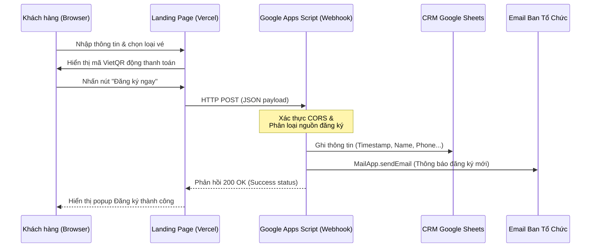
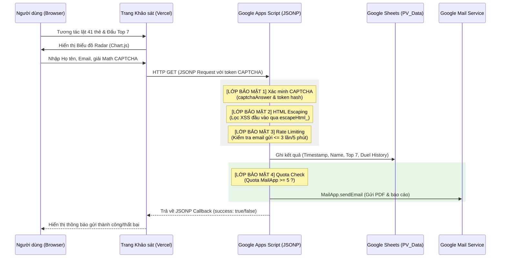
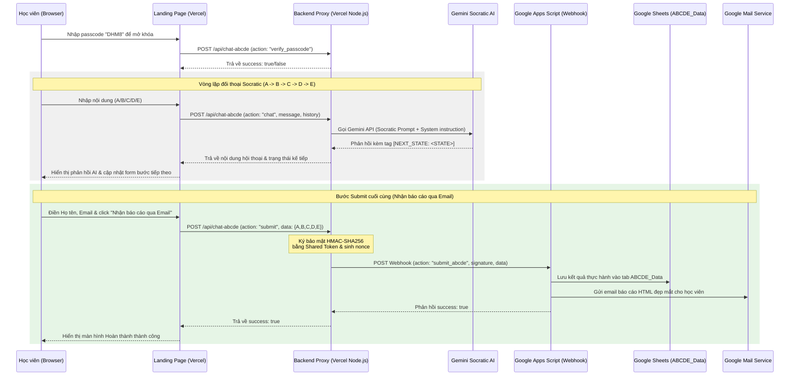
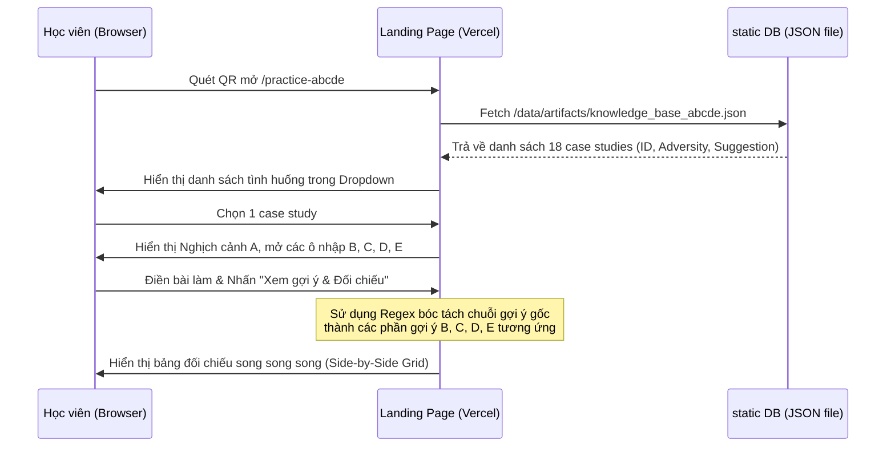

# 🏛️ Kiến trúc Hệ thống (System Architecture)

Hệ thống DH4HN Website được xây dựng trên mô hình serverless (không máy chủ) gọn nhẹ, tối ưu hóa việc truyền và lưu trữ dữ liệu thông qua các API tiêu chuẩn, đồng thời tích hợp các cơ chế bảo mật nghiêm ngặt.

## 1. Sơ đồ Luồng Dữ liệu (Data Flow)

### A. Luồng Đăng ký và Xác thực Thanh toán (Registration & Payment Flow)
Dưới đây là luồng xử lý thông tin khi khách hàng gửi biểu mẫu đăng ký và thực hiện thanh toán chuyển khoản:

### B. Luồng Khảo sát Giá trị Cốt lõi & Bộ lọc Bảo mật (Personal Value Compass & Security Flow)
Luồng tương tác khi người dùng thực hiện bài kiểm tra giá trị cá nhân, đi qua các lớp bảo mật captcha, rate-limiting, quota check trước khi lưu dữ liệu và gửi email:

### C. Luồng Thực hành Lạc quan ABCDE Socratic (Socratic ABCDE Optimism Flow)
Luồng tương tác khi học viên thực hành rèn luyện tư duy lạc quan thông qua máy trạng thái Socratic AI, sau đó lưu kết quả và gửi báo cáo HTML:

### D. Luồng Thực hành điền & đối chiếu Case Study qua QR (ABCDE Practice Sheet & Static RAG Flow)
Luồng tương tác của trang thực hành độc lập, tự động tải dữ liệu tri thức tĩnh từ server và phân rã các bước bằng Regex để đối chiếu bài làm:

## 2. Các Thành phần Kỹ thuật (Technical Components)

### A. Giao diện Client (Frontend)
*   **HTML5 & CSS3:** Sử dụng Native Form để thu thập thông tin khách hàng, tránh trễ tải trang hoặc mất quyền kiểm soát CSS của Google Form iFrame. Hiệu ứng Glassmorphism giúp nâng cao trải nghiệm người dùng.
*   **Chart.js & html2pdf.js:** Hiển thị trực quan hóa biểu đồ radar kết quả khảo sát.
*   **JSONP & HTTP AJAX:** Gọi API chéo miền (cross-domain API) từ trình duyệt khách hàng tới Google Apps Script Web App và Vercel Backend.

### B. Vercel Backend Proxy (Serverless Functions)
*   **API Route:** `/api/chat-abcde.js` (Node.js).
*   **Chức năng:** 
    1.  *Mật mã lớp học:* Kiểm tra passcode chống truy cập trái phép.
    2.  *AI Socratic Integration:* Đóng vai trò cầu nối với Gemini API (`gemini-3.1-flash-lite`), gán System Prompt dẫn dắt, bóc tách tag trạng thái `[NEXT_STATE: <STATE>]` trả về phía client.
    3.  *HMAC Signature Generator:* Tạo chữ ký bảo mật SHA-256 kèm timestamp và nonce duy nhất trên payload trước khi gửi sang Google Apps Script để ngăn chặn các cuộc tấn công phát lại (Replay Attacks) và đảm bảo dữ liệu đến từ nguồn tin cậy.

### C. Google Apps Script Web App (Backend)
*   **Chức năng:** Microservice xử lý yêu cầu JSON/JSONP, điều hướng ghi chép vào CRM Sheets (`DHM8_Data`, `DHM9_Data`, `PV_Data`, `ABCDE_Data`) theo cấu trúc cột chuẩn, đồng thời gửi email thông báo tự động.
*   **Lớp bảo mật backend:**
    1.  *Math CAPTCHA:* Client-side sinh token và server-side giải mã để chống bot gửi request tự động.
    2.  *Rate Limiting:* Giới hạn mỗi email tối đa 3 lần gửi trong 5 phút. Quét sheet để kiểm tra timestamp.
    3.  *Quota Guard:* Kiểm tra quota gửi thư hàng ngày của Google, tự động tắt tính năng gửi email báo cáo khi quota sắp hết để ưu tiên các luồng quan trọng khác.
    4.  *HTML Escaping:* Lọc sạch ký tự nguy hại đầu vào để ngăn ngừa tấn công XSS.

### D. Workspace MCP Server (Quản trị & Tự động hóa)
*   **Mục đích:** Tích hợp với AI Antigravity cho phép tương tác trực tiếp với tài khoản Google để truy xuất CRM Sheet, đọc hoặc gửi email điều trị tự động thông qua Gmail API và Sheets API.
*   **Xác thực:** Google OAuth (OAuth 2.0 Client credentials), lưu trữ credentials tại thư mục cục bộ `C:\Users\vu.hoang\.google_workspace_mcp\credentials\`.
