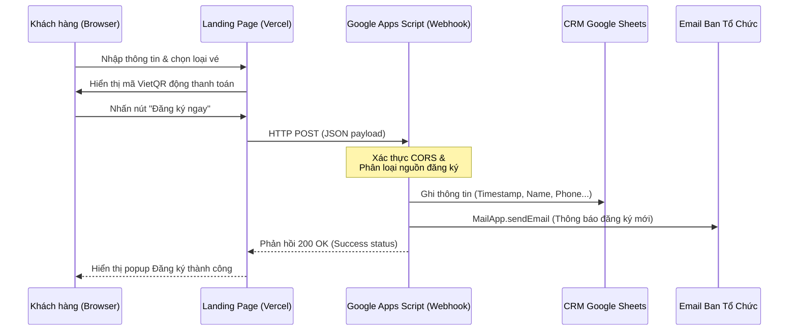
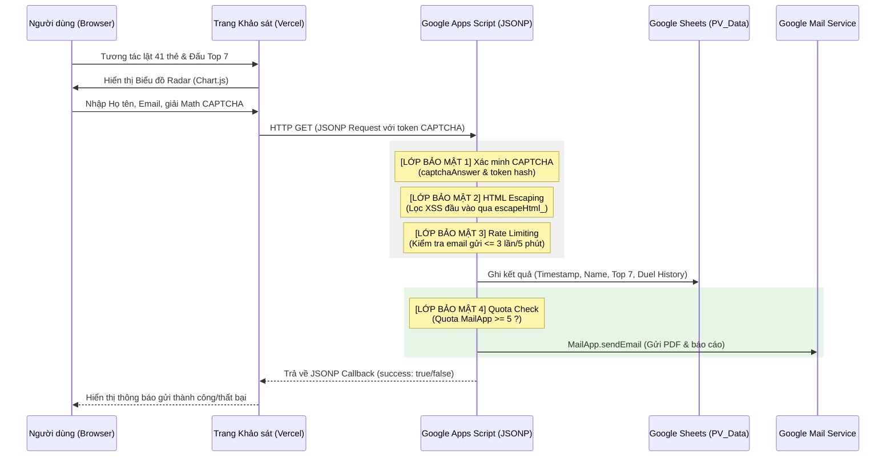

# 🏛️ Kiến trúc Hệ thống (System Architecture)

Hệ thống DH4HN Website được xây dựng trên mô hình serverless (không máy chủ) gọn nhẹ, tối ưu hóa việc truyền và lưu trữ dữ liệu thông qua các API tiêu chuẩn, đồng thời tích hợp các cơ chế bảo mật nghiêm ngặt.

## 1. Sơ đồ Luồng Dữ liệu (Data Flow)

### A. Luồng Đăng ký và Xác thực Thanh toán (Registration & Payment Flow)
Dưới đây là luồng xử lý thông tin khi khách hàng gửi biểu mẫu đăng ký và thực hiện thanh toán chuyển khoản:

### B. Luồng Khảo sát Giá trị Cốt lõi & Bộ lọc Bảo mật (Personal Value Compass & Security Flow)
Luồng tương tác khi người dùng thực hiện bài kiểm tra giá trị cá nhân, đi qua các lớp bảo mật captcha, rate-limiting, quota check trước khi lưu dữ liệu và gửi email:

## 2. Các Thành phần Kỹ thuật (Technical Components)

### A. Giao diện Client (Frontend)
*   **HTML5 & CSS3:** Sử dụng Native Form để thu thập thông tin khách hàng, tránh trễ tải trang hoặc mất quyền kiểm soát CSS của Google Form iFrame. Hiệu ứng Glassmorphism giúp nâng cao trải nghiệm người dùng.
*   **Chart.js & html2pdf.js:** Hiển thị trực quan hóa biểu đồ radar kết quả khảo sát và kết xuất trực tiếp tệp PDF tĩnh ngay tại trình duyệt máy khách để người dùng có thể tải về.
*   **JSONP Protocol:** Gọi API chéo miền (cross-domain API) từ trình duyệt khách hàng tới Google Apps Script Web App mà không bị lỗi chính sách nguồn gốc giống nhau (CORS).

### B. Google Apps Script Web App (Backend)
*   **Chức năng:** Microservice xử lý yêu cầu JSON/JSONP, điều hướng ghi chép vào CRM Sheets (`DHM8_Data`, `DHM9_Data`, `PV_Data`) theo cấu trúc cột chuẩn, đồng thời gửi email thông báo tự động.
*   **Lớp bảo mật backend:**
    1.  *Math CAPTCHA:* Client-side sinh token: `(num1 * 3 + num2 * 7) ^ 90`. Server-side giải mã và đối chiếu để chống bot gửi request tự động.
    2.  *Rate Limiting:* Giới hạn mỗi email tối đa 3 lần gửi trong 5 phút. Quét sheet `PV_Data` để kiểm tra timestamp.
    3.  *Quota Guard:* Kiểm tra `MailApp.getRemainingDailyQuota()`. Nếu dưới 5 mail, tự động tắt tính năng gửi email báo cáo khảo sát để ưu tiên giữ quota cho luồng đăng ký Masterclass quan trọng.
    4.  *HTML Escaping:* Lọc sạch ký tự nguy hại (`&`, `<`, `>`, `"`, `'`) của dữ liệu nhập để ngăn ngừa XSS tấn công CRM Sheet và Admin Email.

### C. Workspace MCP Server (Quản trị & Tự động hóa)
*   **Mục đích:** Tích hợp với AI Antigravity cho phép tương tác trực tiếp với tài khoản Google để truy xuất CRM Sheet, đọc hoặc gửi email điều trị tự động thông qua Gmail API và Sheets API.
*   **Xác thực:** Google OAuth (OAuth 2.0 Client credentials), lưu trữ credentials tại thư mục cục bộ `C:\Users\vu.hoang\.google_workspace_mcp\credentials\`.
