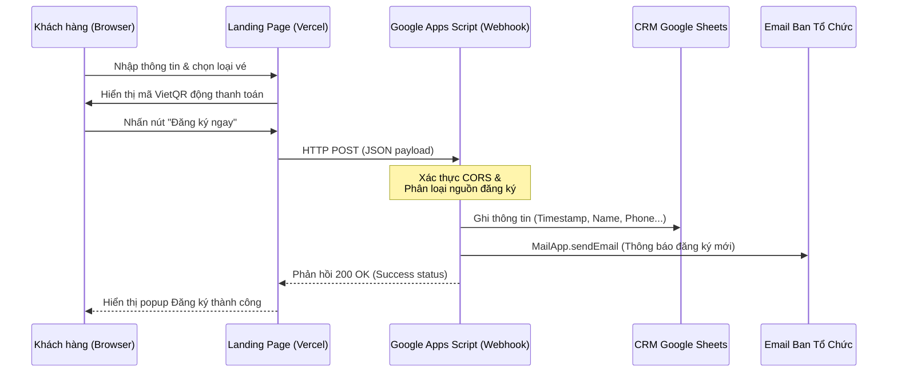

# 🏛️ Kiến trúc Hệ thống (System Architecture)

Hệ thống DH4HN Website được xây dựng trên mô hình serverless gọn nhẹ, tối ưu hóa việc truyền và lưu trữ dữ liệu thông qua các API tiêu chuẩn.

## 1. Sơ đồ Luồng Dữ liệu (Data Flow)

Dưới đây là luồng xử lý thông tin khi khách hàng gửi biểu mẫu đăng ký:

## 2. Các Thành phần Kỹ thuật (Technical Components)

### A. Giao diện Client (Frontend)
*   Sử dụng HTML5 Native Form để thu thập thông tin của khách hàng trực tiếp, tránh trễ tải trang hoặc mất quyền kiểm soát CSS của Google Form iFrame.
*   Thư viện `tracking.js` tự động ghi nhận các sự kiện:
    *   `PAGE_VIEW`: Khi người dùng mở trang.
    *   `SCROLL_REACH`: Khi người dùng cuộn đến phần biểu mẫu để đo lường độ quan tâm.

### B. Google Apps Script Webhook (Backend)
*   **GAS Web App URL:** `https://script.google.com/macros/s/AKfycby1-xHkVxBomRyqbL6GGDnwHXSLsmV7FOLX4XgFXCmoltvOeBM9r6WZQrRB_lIFFAUqyw/exec`
*   **Quyền thực thi:** Thực thi dưới danh nghĩa tài khoản quản trị `culturecodeproject@gmail.com`.
*   **Chức năng:** Nhận yêu cầu JSON, điều hướng ghi chép vào CRM Sheets theo cấu trúc 12 cột chuẩn, đồng thời gửi email thông báo realtime cho ban tổ chức.

### C. Workspace MCP Server (Quản trị & Tự động hóa)
*   **Mục đích:** Tích hợp với AI Antigravity cho phép tương tác trực tiếp với tài khoản Google để truy xuất CRM Sheet, đọc hoặc gửi email điều trị tự động thông qua Gmail API và Sheets API.
*   **Xác thực:** Google OAuth (OAuth 2.0 Client credentials), lưu trữ credentials tại thư mục cục bộ `C:\Users\vu.hoang\.google_workspace_mcp\credentials\`.
