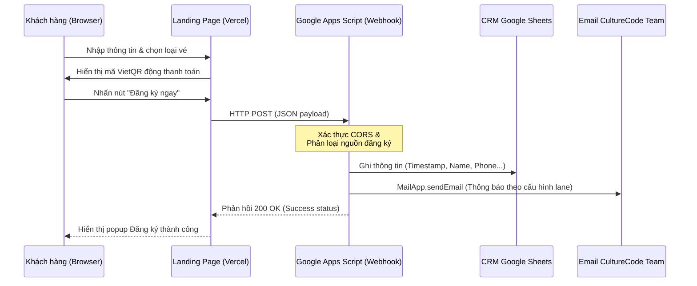
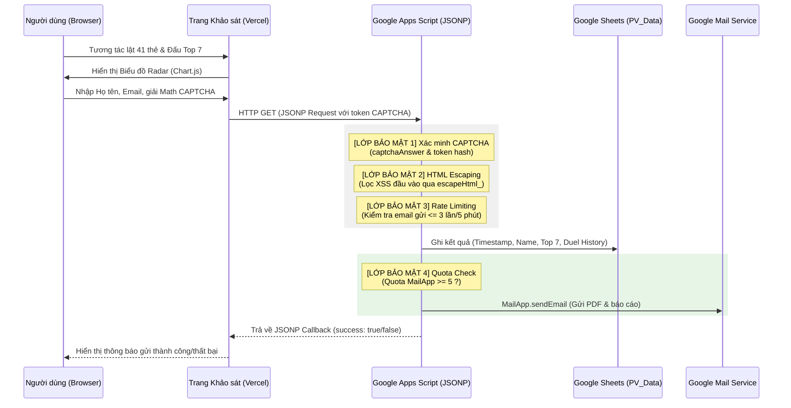
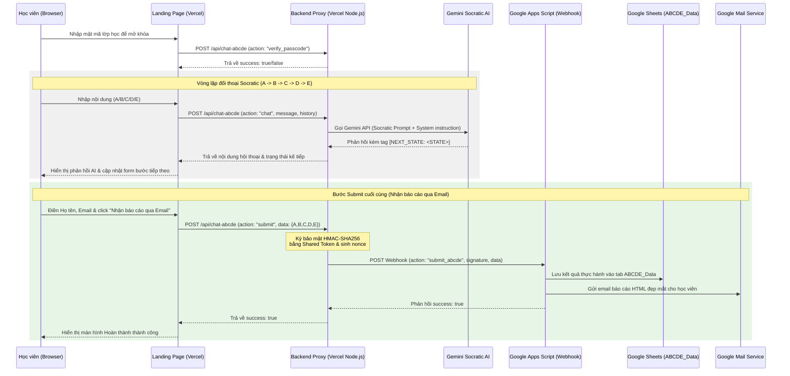
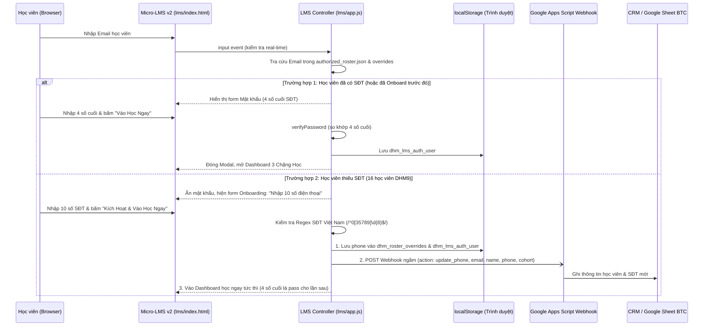
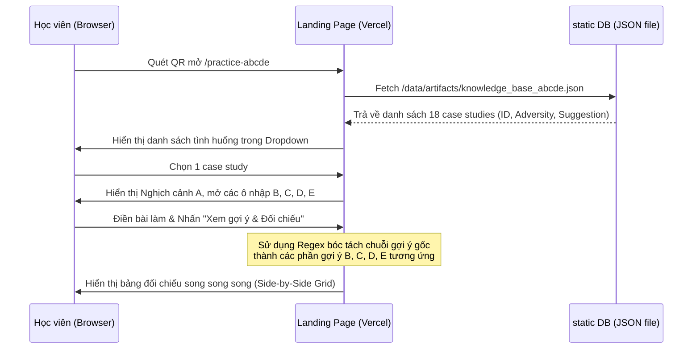
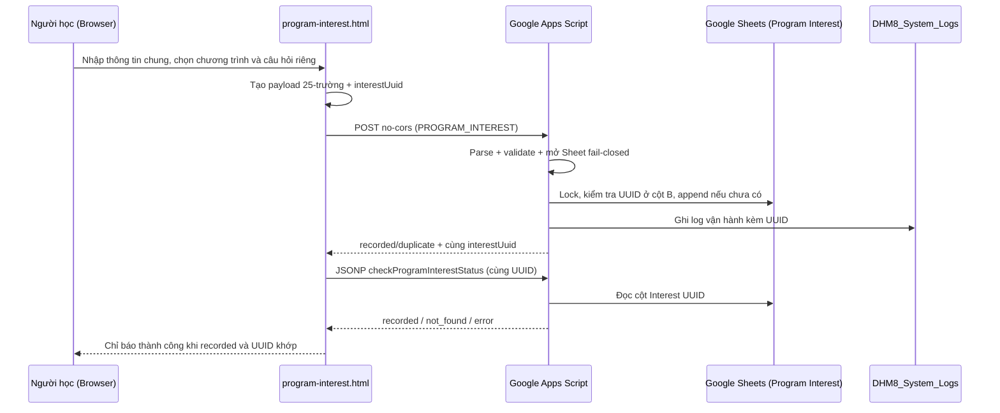
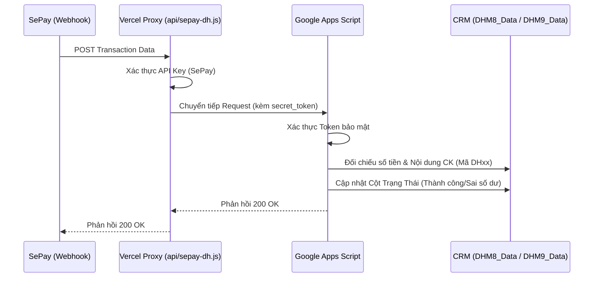
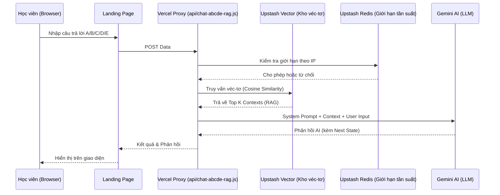

# 🏛️ Kiến trúc Hệ thống (System Architecture)

Hệ thống DH4HN Website được xây dựng trên mô hình serverless (không máy chủ) gọn nhẹ, tối ưu hóa việc truyền và lưu trữ dữ liệu thông qua các API tiêu chuẩn, đồng thời tích hợp các cơ chế bảo mật nghiêm ngặt.

## 1. Sơ đồ Luồng Dữ liệu (Data Flow)

### A. Luồng Đăng ký và Xác thực Thanh toán (Registration & Payment Flow)
Dưới đây là luồng xử lý thông tin khi khách hàng gửi biểu mẫu đăng ký và thực hiện thanh toán chuyển khoản:

```mermaid
sequenceDiagram
    participant User as Khách hàng (Browser)
    participant Web as Landing Page (Vercel)
    participant GAS as Google Apps Script (Webhook)
    participant CRM as CRM Google Sheets
    participant Team as Email CultureCode Team

    User->>Web: Nhập thông tin & chọn loại vé
    Web->>User: Hiển thị mã VietQR động thanh toán
    User->>Web: Nhấn nút "Đăng ký ngay"
    Web->>GAS: HTTP POST (JSON payload)
    Note over GAS: Xác thực CORS &<br/>Phân loại nguồn đăng ký
    GAS->>CRM: Ghi thông tin (Timestamp, Name, Phone...)
    GAS->>Team: MailApp.sendEmail (Thông báo theo cấu hình lane)
    GAS-->>Web: Phản hồi 200 OK (Success status)
    Web-->>User: Hiển thị popup Đăng ký thành công
```

### B. Luồng Khảo sát Giá trị Cốt lõi & Bộ lọc Bảo mật (Personal Value Compass & Security Flow)
Luồng tương tác khi người dùng thực hiện bài kiểm tra giá trị cá nhân, đi qua các lớp bảo mật captcha, rate-limiting, quota check trước khi lưu dữ liệu và gửi email:

```mermaid
sequenceDiagram
    participant User as Người dùng (Browser)
    participant PV as Trang Khảo sát (Vercel)
    participant GAS as Google Apps Script (JSONP)
    participant Sheet as Google Sheets (PV_Data)
    participant Gmail as Google Mail Service

    User->>PV: Tương tác lật 41 thẻ & Đấu Top 7
    PV->>User: Hiển thị Biểu đồ Radar (Chart.js)
    User->>PV: Nhập Họ tên, Email, giải Math CAPTCHA
    PV->>GAS: HTTP GET (JSONP Request với token CAPTCHA)
    
    rect rgb(240, 240, 240)
        Note over GAS: [LỚP BẢO MẬT 1] Xác minh CAPTCHA<br/>(captchaAnswer & token hash)
        Note over GAS: [LỚP BẢO MẬT 2] HTML Escaping<br/>(Lọc XSS đầu vào qua escapeHtml_)
        Note over GAS: [LỚP BẢO MẬT 3] Rate Limiting<br/>(Kiểm tra email gửi <= 3 lần/5 phút)
    end
    
    GAS->>Sheet: Ghi kết quả (Timestamp, Name, Top 7, Duel History)
    
    rect rgb(230, 245, 230)
        Note over GAS: [LỚP BẢO MẬT 4] Quota Check<br/>(Quota MailApp >= 5 ?)
        GAS->>Gmail: MailApp.sendEmail (Gửi PDF & báo cáo)
    end
    
    GAS-->>PV: Trả về JSONP Callback (success: true/false)
    PV-->>User: Hiển thị thông báo gửi thành công/thất bại
```

### C. Luồng Thực hành Lạc quan ABCDE Socratic (Socratic ABCDE Optimism Flow)
Luồng tương tác khi học viên thực hành rèn luyện tư duy lạc quan thông qua máy trạng thái Socratic AI, sau đó lưu kết quả và gửi báo cáo HTML:

```mermaid
sequenceDiagram
    participant User as Học viên (Browser)
    participant Web as Landing Page (Vercel)
    participant Proxy as Backend Proxy (Vercel Node.js)
    participant Gemini as Gemini Socratic AI
    participant GAS as Google Apps Script (Webhook)
    participant Sheet as Google Sheets (ABCDE_Data)
    participant Gmail as Google Mail Service

    User->>Web: Nhập mật mã lớp học để mở khóa
    Web->>Proxy: POST /api/chat-abcde (action: "verify_passcode")
    Proxy-->>Web: Trả về success: true/false
    
    rect rgb(240, 240, 240)
        Note over User,Gemini: Vòng lặp đối thoại Socratic (A -> B -> C -> D -> E)
        User->>Web: Nhập nội dung (A/B/C/D/E)
        Web->>Proxy: POST /api/chat-abcde (action: "chat", message, history)
        Proxy->>Gemini: Gọi Gemini API (Socratic Prompt + System instruction)
        Gemini-->>Proxy: Phản hồi kèm tag [NEXT_STATE: <STATE>]
        Proxy-->>Web: Trả về nội dung hội thoại & trạng thái kế tiếp
        Web-->>User: Hiển thị phản hồi AI & cập nhật form bước tiếp theo
    end

    rect rgb(230, 245, 230)
        Note over User,Gmail: Bước Submit cuối cùng (Nhận báo cáo qua Email)
        User->>Web: Điền Họ tên, Email & click "Nhận báo cáo qua Email"
        Web->>Proxy: POST /api/chat-abcde (action: "submit", data: {A,B,C,D,E})
        Note over Proxy: Ký bảo mật HMAC-SHA256<br/>bằng Shared Token & sinh nonce
        Proxy->>GAS: POST Webhook (action: "submit_abcde", signature, data)
        GAS->>Sheet: Lưu kết quả thực hành vào tab ABCDE_Data
        GAS->>Gmail: Gửi email báo cáo HTML đẹp mắt cho học viên
        GAS-->>Proxy: Phản hồi success: true
        Proxy-->>Web: Trả về success: true
        Web-->>User: Hiển thị màn hình Hoàn thành thành công
    end
```

### D. Luồng Xác thực Micro-LMS v2 & Onboarding Số điện thoại Tự phục vụ (Micro-LMS v2 Auth & Self-Service Onboarding Flow)
Luồng đăng nhập thông minh và bổ sung thông tin tự phục vụ dành cho học viên Delivering Happiness Masterclass:

```mermaid
sequenceDiagram
    participant Learner as Học viên (Browser)
    participant LMS as Micro-LMS v2 (lms/index.html)
    participant Engine as LMS Controller (lms/app.js)
    participant Local as localStorage (Trình duyệt)
    participant GAS as Google Apps Script Webhook
    participant Sheet as CRM / Google Sheet BTC

    Learner->>LMS: Nhập Email học viên
    LMS->>Engine: input event (kiểm tra real-time)
    Engine->>Engine: Tra cứu Email trong authorized_roster.json & overrides
    
    alt Trường hợp 1: Học viên đã có SĐT (hoặc đã Onboard trước đó)
        Engine-->>LMS: Hiển thị form Mật khẩu (4 số cuối SĐT)
        Learner->>LMS: Nhập 4 số cuối & bấm "Vào Học Ngay"
        Engine->>Engine: verifyPassword (so khớp 4 số cuối)
        Engine->>Local: Lưu dhm_lms_auth_user
        Engine-->>LMS: Đóng Modal, mở Dashboard 3 Chặng Học
    else Trường hợp 2: Học viên thiếu SĐT (16 học viên DHM9)
        Engine-->>LMS: Ẩn mật khẩu, hiện form Onboarding: "Nhập 10 số điện thoại"
        Learner->>LMS: Nhập 10 số SĐT & bấm "Kích Hoạt & Vào Học Ngay"
        Engine->>Engine: Kiểm tra Regex SĐT Việt Nam (/^0[35789]\d{8}$/)
        Engine->>Local: 1. Lưu phone vào dhm_roster_overrides & dhm_lms_auth_user
        Engine-)GAS: 2. POST Webhook ngầm (action: update_phone, email, name, phone, cohort)
        GAS->>Sheet: Ghi thông tin học viên & SĐT mới
        Engine-->>LMS: 3. Vào Dashboard học ngay tức thì (4 số cuối là pass cho lần sau)
    end
```

### E. Luồng Thực hành điền & đối chiếu Case Study qua QR (ABCDE Practice Sheet & Static RAG Flow)
Luồng tương tác của trang thực hành độc lập, tự động tải dữ liệu tri thức tĩnh từ server và phân rã các bước bằng Regex để đối chiếu bài làm:

```mermaid
sequenceDiagram
    participant User as Học viên (Browser)
    participant Web as Landing Page (Vercel)
    participant JSON as static DB (JSON file)

    User->>Web: Quét QR mở /practice-abcde
    Web->>JSON: Fetch /data/artifacts/knowledge_base_abcde.json
    JSON-->>Web: Trả về danh sách 18 case studies (ID, Adversity, Suggestion)
    Web->>User: Hiển thị danh sách tình huống trong Dropdown
    
    User->>Web: Chọn 1 case study
    Web->>User: Hiển thị Nghịch cảnh A, mở các ô nhập B, C, D, E
    
    User->>Web: Điền bài làm & Nhấn "Xem gợi ý & Đối chiếu"
    Note over Web: Sử dụng Regex bóc tách chuỗi gợi ý gốc<br/>thành các phần gợi ý B, C, D, E tương ứng
    Web->>User: Hiển thị bảng đối chiếu song song song (Side-by-Side Grid)
```

### E. Luồng Ghi nhận Quan tâm Nhiều Chương trình (Multi-program Interest Flow)
`program-interest.html` là trang trung tâm cho DHM8, DHM9, NVC và AI. Đây chỉ là luồng ghi nhận quan tâm; đăng ký chính thức, giữ chỗ và thanh toán vẫn đi qua các form chuyên biệt.

**Đích dữ liệu (data destination - nơi lưu dữ liệu):** [CRM Google Sheet — tab Program Interest](https://docs.google.com/spreadsheets/d/1ZToRX6J5Vo6UgHzYEE_eUxU0bVnsGxBRLt-8tduI5CA/edit). Tài liệu chỉ công bố link và tên tab; giá trị `SPREADSHEET_ID` thực tế nằm trong `Script Properties` của Apps Script. `parentId` trong `.clasp.json` chỉ là metadata container của Apps Script, không phải runtime target; runtime target phải được kiểm chứng bằng Script Properties/authorized read-back hoặc UAT có kiểm soát. Endpoint production hiện được frontend gọi là `AKfycbxMi_bQBceGxVK_TjbcU5rQNAaLyUXOMuQJHyYWCwdeoWlsccq2kFkhRYVG2meySCsPdA` (deployment `@69`).

```mermaid
sequenceDiagram
    participant User as Người học (Browser)
    participant Hub as program-interest.html
    participant GAS as Google Apps Script
    participant Sheet as Google Sheets (Program Interest)
    participant Logs as DHM8_System_Logs

    User->>Hub: Nhập thông tin chung, chọn chương trình và câu hỏi riêng
    Hub->>Hub: Tạo payload 25-trường + interestUuid
    Hub->>GAS: POST no-cors (PROGRAM_INTEREST)
    GAS->>GAS: Parse + validate + mở Sheet fail-closed
    GAS->>Sheet: Lock, kiểm tra UUID ở cột B, append nếu chưa có
    GAS->>Logs: Ghi log vận hành kèm UUID
    GAS-->>Hub: recorded/duplicate + cùng interestUuid
    Hub->>GAS: JSONP checkProgramInterestStatus (cùng UUID)
    GAS->>Sheet: Đọc cột Interest UUID
    GAS-->>Hub: recorded / not_found / error
    Hub-->>User: Chỉ báo thành công khi recorded và UUID khớp
```

#### Hợp đồng dữ liệu và ánh xạ cột

| Vùng cột | Nội dung | Nguồn/qui tắc |
|---|---|---|
| A | `Timestamp` | Apps Script tạo thời điểm ghi |
| B | `Interest UUID` | Khóa `idempotency` (gửi lại không tạo dòng mới); bắt buộc 32 ký tự hex hoặc UUID chuẩn |
| C–H | Họ tên, email, điện thoại, công ty, vai trò, khu vực | Dữ liệu chung sau chuẩn hóa độ dài |
| I | Chương trình quan tâm | Danh sách mã hợp lệ: `DHM8`, `DHM9`, `NVC`, `AI`, `PSYCHOLOGICAL_SAFETY`, `CULTURE101` |
| J–M | Cờ `DHM8`, `DHM9`, `NVC`, `AI` | Apps Script tạo từ danh sách chương trình |
| N–U | Kỳ vọng/khóa và thông tin chi tiết theo chương trình | Chỉ ghi phần tương ứng với chương trình đã chọn |
| V–W | Ghi chú, đồng ý liên hệ | `consent` phải được cấp |
| X–Y | `Source`, `Event ID` | Luồng này dùng `Web_Program_Interest` và `PROGRAM_INTEREST_V1` |

Frontend gửi `POST` ở chế độ `no-cors` (gửi khác miền nhưng không đọc được phản hồi trực tiếp), nên kết quả ghi được xác nhận bằng JSONP. Máy trạng thái hiện retry tối đa 4 lần trong ngân sách 45 giây; timeout/lỗi tạm thời được thử lại, còn `INVALID_UUID` và UUID mismatch dừng ngay. Nếu hết ngân sách, giao diện chỉ báo “chưa kiểm tra được trạng thái ghi nhận”, không kết luận dữ liệu chưa ghi. Gửi lại cùng payload khi fingerprint không đổi sẽ giữ cùng UUID.

Apps Script dùng `LockService`, kiểm tra UUID trong cột B trước `appendRow`, rồi trả `duplicate: true` cho lần gửi lại cùng UUID. Mỗi POST cũng có thể tạo một dòng vận hành trong `DHM8_System_Logs`; đó không phải là một dòng dữ liệu mới trong tab `Program Interest`. Handler `PROGRAM_INTEREST` không gọi hàng đợi email, webhook thanh toán hoặc logic giữ chỗ.

Mã frontend và handler được đối chiếu trực tiếp trong source local. Production frontend và một lượt ghi/read-back Google Sheet thật đã có evidence tại `UAT/evidence/codex_program_interest_confirmation_live_20260812/real-write-readback-20260812.md`; `parentId` không được dùng thay cho runtime `SPREADSHEET_ID`. Các lượt UAT thật tiếp theo vẫn là cổng UAT (User Acceptance Testing - kiểm thử nghiệm thu người dùng) Cấp độ 3 riêng.

### F. Luồng Auto-Reconciliation SePay Webhook (Thanh toán Tự động)
Luồng tự động đối soát thanh toán thông qua SePay Webhook, giảm thiểu công việc xác nhận thủ công:

```mermaid
sequenceDiagram
    participant Webhook as SePay (Webhook)
    participant API as Vercel Proxy (api/sepay-dh.js)
    participant GAS as Google Apps Script
    participant Sheet as CRM (DHM8_Data / DHM9_Data)

    Webhook->>API: POST Transaction Data
    API->>API: Xác thực API Key (SePay)
    API->>GAS: Chuyển tiếp Request (kèm secret_token)
    GAS->>GAS: Xác thực Token bảo mật
    GAS->>Sheet: Đối chiếu số tiền & Nội dung CK (Mã DHxx)
    GAS->>Sheet: Cập nhật Cột Trạng Thái (Thành công/Sai số dư)
    GAS-->>API: Phản hồi 200 OK
    API-->>Webhook: Phản hồi 200 OK
```

### G. Luồng Socratic Vector RAG (Upstash Redis + Cosine Similarity)
Luồng RAG mới bổ sung context động từ Vector database để AI trả lời sát với hệ sinh thái bài học:

```mermaid
sequenceDiagram
    participant User as Học viên (Browser)
    participant Web as Landing Page
    participant API as Vercel Proxy (api/chat-abcde-rag.js)
    participant Vector as Upstash Vector (Kho véc-tơ)
    participant Redis as Upstash Redis (Giới hạn tần suất)
    participant Gemini as Gemini AI (LLM)

    User->>Web: Nhập câu trả lời A/B/C/D/E
    Web->>API: POST Data
    API->>Redis: Kiểm tra giới hạn theo IP
    Redis-->>API: Cho phép hoặc từ chối
    API->>Vector: Truy vấn véc-tơ (Cosine Similarity)
    Vector-->>API: Trả về Top K Contexts (RAG)
    API->>Gemini: System Prompt + Context + User Input
    Gemini-->>API: Phản hồi AI (kèm Next State)
    API-->>Web: Kết quả & Phản hồi
    Web-->>User: Hiển thị trên giao diện
```

## 2. Các Thành phần Kỹ thuật (Technical Components)

### A. Giao diện Client (Frontend)
*   **HTML5 & CSS3:** Sử dụng Native Form để thu thập thông tin khách hàng, tránh trễ tải trang hoặc mất quyền kiểm soát CSS của Google Form iFrame. Hiệu ứng Glassmorphism giúp nâng cao trải nghiệm người dùng.
*   **Chart.js & html2pdf.js:** Hiển thị trực quan hóa biểu đồ radar kết quả khảo sát.
*   **JSONP & HTTP AJAX:** Gọi API chéo miền (cross-domain API) từ trình duyệt khách hàng tới Google Apps Script Web App và Vercel Backend.

### B. Vercel Backend Proxy (Serverless Functions)
*   **API Routes:**
    *   `/api/chat-abcde.js` (Node.js) - Luồng tĩnh cơ bản.
    *   `/api/chat-abcde-rag.js` - Luồng RAG Beta có vector context.
    *   `/api/sepay-dh.js` - API nhận webhook thanh toán.
*   **Chức năng:** 
    1.  *Mật mã lớp học:* Kiểm tra passcode chống truy cập trái phép.
    2.  *AI Socratic Integration:* Đóng vai trò cầu nối với Gemini API (`gemini-3.1-flash-lite`), gán System Prompt dẫn dắt, bóc tách tag trạng thái `[NEXT_STATE: <STATE>]` trả về phía client.
    3.  *HMAC Signature Generator:* Tạo chữ ký SHA-256 kèm timestamp và nonce cho submit ABCDE. Apps Script hiện chưa có bước verify tương ứng, nên bảo vệ đầu-cuối vẫn `UNVERIFIED`.
    4.  *Rate Limiting:* Dùng Upstash Redis theo IP; nếu thiếu cấu hình hoặc lỗi, source dùng bộ đếm in-memory. Không có bằng chứng giới hạn theo email/User ID trong code hiện tại.

### C. Google Apps Script Web App (Backend)
*   **Chức năng:** Microservice xử lý yêu cầu JSON/JSONP, điều hướng ghi chép vào CRM Sheets (`DHM8_Data`, `DHM9_Data`, `PV_Data`, `ABCDE_Data`) theo cấu trúc cột chuẩn, đồng thời gửi email thông báo tự động. Riêng `PROGRAM_INTEREST` ghi vào tab `Program Interest` và không có tác dụng phụ email/thanh toán.
*   **Phân hệ Độc lập (Microservice riêng):** Form đăng ký NVC (`register_nvc.html`) kết nối tới dự án Apps Script riêng `CultureCode - NVC Webhook` (Script ID: `1jD15w91bPsE0xn0PyrlJgkeHfg-jqFXWoFG15KHBqFufuA4Dt7iiJsGu`), lưu trữ độc lập vào Google Sheet `CultureCode - NVC Leads` (ID: `12HNH6ANgtcRyF0lMqObkEGDB5U8LVi9kLWebJyHJ3kk`) với cấu trúc 13 cột và gửi mail báo về 3 email CultureCode Team.
*   *(Chi tiết toàn bộ bảng tra cứu biểu mẫu, webhook và Google Sheets xem tại [forms-and-data-destinations.md](file:///C:/Users/vu.hoang/.gemini/antigravity/scratch/dh4hn-website/docs/forms-and-data-destinations.md)).*
*   **Lớp bảo mật backend:**
    1.  *Math CAPTCHA:* Client-side sinh token và server-side giải mã để chống bot gửi request tự động.
    2.  *Rate Limiting:* Giới hạn mỗi email tối đa 3 lần gửi trong 5 phút. Quét sheet để kiểm tra timestamp.
    3.  *Quota Guard:* Kiểm tra quota gửi thư hàng ngày của Google, tự động tắt tính năng gửi email báo cáo khi quota sắp hết để ưu tiên các luồng quan trọng khác.
    4.  *HTML Escaping:* Lọc sạch ký tự nguy hại đầu vào để ngăn ngừa tấn công XSS.
    5.  *Dynamic Email Binding (Rule 5):* Tự động điều hướng và ghép file template chính xác cho từng loại email/chiến dịch mà không cần hardcode trong GAS.

Các lớp CAPTCHA và giới hạn tần suất được áp dụng theo từng lane, không mặc định cho mọi route. `PROGRAM_INTEREST` hiện chỉ có kiểm tra dữ liệu phía máy chủ, UUID idempotency và formula guard (chặn công thức nguy hiểm trong Sheet); chưa có CAPTCHA hoặc giới hạn tần suất riêng.

### D. Workspace MCP Server (Quản trị & Tự động hóa)
*   **Mục đích:** Tích hợp với tác nhân AI để truy xuất CRM Sheet hoặc thực hiện quy trình Gmail/Sheets có phê duyệt.
*   **Xác thực:** Dùng Google OAuth; credential nằm ngoài repository và tuyệt đối không được ghi vào tài liệu, log hoặc artifact.

### E. Phân hệ Micro-LMS v2 & Master Learner Registry
*   **Mục đích:** Cung cấp trải nghiệm học tập số hóa tương tác (90 phút) cho học viên Delivering Happiness Masterclass, đảm bảo phân quyền danh bạ chính xác, lưu giữ phản tư cá nhân (I•A•M), và tự động bổ sung số điện thoại tự phục vụ.
*   **Các thành phần cốt lõi:**
    1.  *Giao diện LMS Web (`lms/index.html`):* SPA (Single Page Application) hiện đại xây dựng trên Tailwind CSS Glassmorphism, 3 chặng học tuần tự, bài tập trắc nghiệm tự chấm điểm, la bàn Me Values tương tác, và công cụ chuyển hóa nghịch cảnh ABCDE.
    2.  *Bộ điều khiển Client (`lms/app.js`):* Quản lý phiên làm việc (`dhm_lms_auth_user`), nhận diện học viên thời gian thực, cơ chế Onboarding SĐT lưu đè `localStorage` (`dhm_roster_overrides`), và đồng bộ nền (background sync) dữ liệu học viên & phản tư về Google Apps Script qua `GOOGLE_APPS_SCRIPT_URL`.
    3.  *Danh bạ phân quyền (`lms/authorized_roster.json`):* 117 tài khoản được ủy quyền (Coach, DHM8, DHM9, Đăng ký mới).
    4.  *Cơ sở dữ liệu học viên tổng quát (`master_learners_roster.json` & `.csv`):* Chuẩn hóa cấu trúc 117 học viên kèm mã định danh `learner_id`, trạng thái số điện thoại (`verified`, `legacy_partial`, `missing`), và phân loại doanh nghiệp/tổ chức tự động từ email domain. Chi tiết cấu trúc xem tại [LEARNER_DATA_SCHEMA.md](file:///C:/Users/vu.hoang/.gemini/antigravity/scratch/Teaching%20DH/Artifacts/LEARNER_DATA_SCHEMA.md).

## 3. Ma trận Ranh giới Kiểm chứng

| Bề mặt | Trạng thái của lượt cập nhật tài liệu | Bằng chứng |
|---|---|---|
| File frontend/backend local | `VERIFIED` | Đọc trực tiếp `chat-abcde.js`, `api/`, `Scripts/active_code_gs_final.js`, `interest.html`, `program-interest.html` |
| Route inventory trong Git | `VERIFIED` | `origin/main` commit `a0b4b6f` có `program-interest.html` và `release-specs/dhm10-homepage.json` |
| Vercel production + browser Program Interest | `VERIFIED` | `UAT/evidence/codex_program_interest_confirmation_live_20260812/real-write-readback-20260812.md`; report Gemini cùng ngày chỉ là simulated UAT (kiểm thử mô phỏng) vì ghi rõ `Apps Script Requests Continued: 0` và `External writes: NONE` |
| Apps Script contract/deployment | `VERIFIED` ở mức source/read-only | `Scripts/active_code_gs_final.js`, endpoint @69 và release/UAT artifacts nêu trên |
| Google Sheet runtime target + real write/read-back | `VERIFIED` | `UAT/evidence/codex_program_interest_confirmation_live_20260812/real-write-readback-20260812.md` — đúng 1 UUID UAT, đúng 1 dòng, JSONP `recorded`; `.clasp.json.parentId` không được dùng làm runtime target |

Tài liệu kiến trúc chỉ chứng minh cấu trúc và hợp đồng source; không thay thế UAT runtime.
