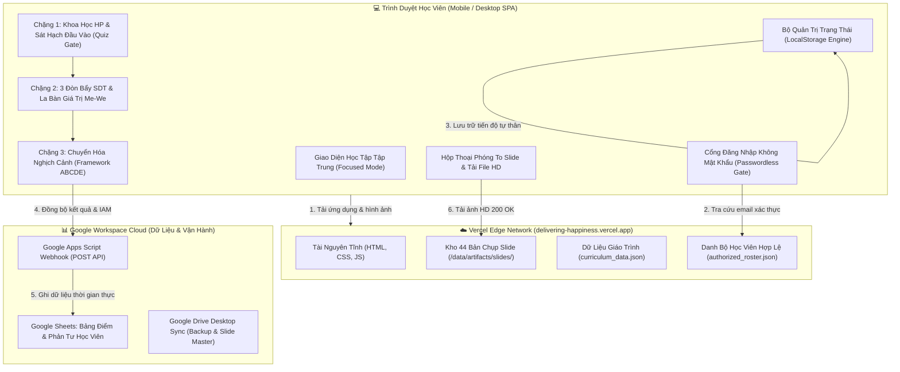
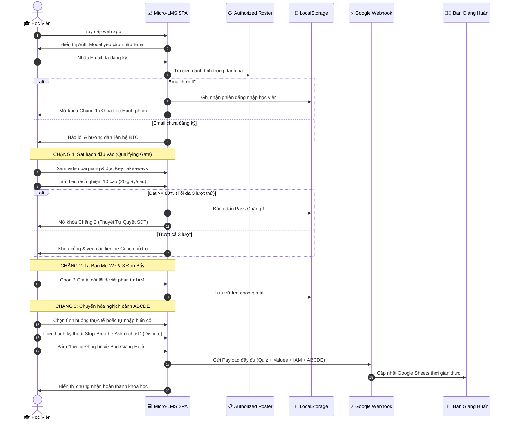
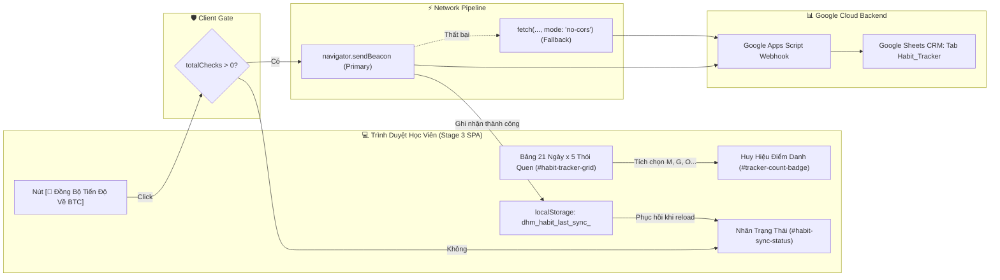

# Kiến Trúc Hệ Thống (System Architecture) — Delivering Happiness Blended Learning LMS

Tài liệu này mô tả chi tiết kiến trúc kỹ thuật, luồng dữ liệu, ranh giới an toàn và các tích hợp ngoại vi của hệ thống Micro-LMS Blended Learning 3 Chặng thuộc dự án Delivering Happiness (DHM).

---

## 1. Sơ Đồ Kiến Trúc Tổng Thể (High-Level Architecture)

Hệ thống được thiết kế theo mô hình **Serverless Jamstack Micro-LMS**:
- Giao diện đơn trang (Single Page Application - SPA) siêu nhẹ viết bằng HTML5/CSS3/Vanilla JavaScript chuẩn ES6+.
- Lưu trữ trạng thái cục bộ tại trình duyệt qua `localStorage` kết hợp đồng bộ đa kênh về Google Sheets thông qua Google Apps Script Webhook.
- Toàn bộ tài nguyên tĩnh (HTML, CSS, JS, Slide Infographics PNG, Data JSON) được lưu trữ và phân phối qua mạng phân phối nội dung (CDN) của Vercel.


```mermaid
graph TD
    subgraph Client["💻 Trình Duyệt Học Viên (Mobile / Desktop SPA)"]
        UI["Giao Diện Học Tập Tập Trung (Focused Mode)"]
        AuthModal["Cổng Đăng Nhập Không Mật Khẩu (Passwordless Gate)"]
        StateEngine["Bộ Quản Trị Trạng Thái (LocalStorage Engine)"]
        S1["Chặng 1: Khoa Học HP & Sát Hạch Đầu Vào (Quiz Gate)"]
        S2["Chặng 2: 3 Đòn Bẩy SDT & La Bàn Giá Trị Me-We"]
        S3["Chặng 3: Chuyển Hóa Nghịch Cảnh (Framework ABCDE)"]
        SlideViewer["Hộp Thoại Phóng To Slide & Tải File HD"]
    end

    subgraph CDN["☁️ Vercel Edge Network (delivering-happiness.vercel.app)"]
        StaticAssets["Tài Nguyên Tĩnh (HTML, CSS, JS)"]
        SlideImages["Kho 44 Bản Chụp Slide (/data/artifacts/slides/)"]
        DataConfig["Dữ Liệu Giáo Trình (curriculum_data.json)"]
        RosterConfig["Danh Bộ Học Viên Hợp Lệ (authorized_roster.json)"]
    end

    subgraph Backend["📊 Google Workspace Cloud (Dữ Liệu & Vận Hành)"]
        GAS["Google Apps Script Webhook (POST API)"]
        GSheets["Google Sheets: Bảng Điểm & Phản Tư Học Viên"]
        DriveSync["Google Drive Desktop Sync (Backup & Slide Master)"]
    end

    Client -->|1. Tải ứng dụng & hình ảnh| CDN
    AuthModal -->|2. Tra cứu email xác thực| RosterConfig
    StateEngine -->|3. Lưu trữ tiến độ tự thân| StateEngine
    S1 --> S2 --> S3
    S3 -->|4. Đồng bộ kết quả & IAM| GAS
    GAS -->|5. Ghi dữ liệu thời gian thực| GSheets
    SlideViewer -->|6. Tải ảnh HD 200 OK| SlideImages
```

---

## 2. Luồng Trải Nghiệm Học Tập 3 Chặng (3-Stage Pedagogical Flow)

Mô hình sư phạm kết hợp (Blended Learning) liên kết chặt chẽ giữa học trực tuyến trước khóa học, thực hành trực tiếp tại lớp và đồng hành chuyển hóa sau khóa học:


```mermaid
sequenceDiagram
    autonumber
    actor Learner as 🎓 Học Viên
    participant LMS as 💻 Micro-LMS SPA
    participant Roster as 📋 Authorized Roster
    participant Local as 💾 LocalStorage
    participant Webhook as ⚡ Google Webhook
    participant Faculty as 👨‍🏫 Ban Giảng Huấn

    Learner->>LMS: Truy cập web app
    LMS->>Learner: Hiển thị Auth Modal yêu cầu nhập Email
    Learner->>LMS: Nhập Email đã đăng ký
    LMS->>Roster: Tra cứu danh tính trong danh bạ
    alt Email hợp lệ
        LMS->>Local: Ghi nhận phiên đăng nhập học viên
        LMS->>Learner: Mở khóa Chặng 1 (Khoa học Hạnh phúc)
    else Email chưa đăng ký
        LMS->>Learner: Báo lỗi & hướng dẫn liên hệ BTC
    end

    Note over Learner,LMS: CHẶNG 1: Sát hạch đầu vào (Qualifying Gate)
    Learner->>LMS: Xem video bài giảng & đọc Key Takeaways
    Learner->>LMS: Làm bài trắc nghiệm 10 câu (20 giây/câu)
    alt Đạt >= 80% (Tối đa 3 lượt thử)
        LMS->>Local: Đánh dấu Pass Chặng 1
        LMS->>Learner: Mở khóa Chặng 2 (Thuyết Tự Quyết SDT)
    else Trượt cả 3 lượt
        LMS->>Learner: Khóa cổng & yêu cầu liên hệ Coach hỗ trợ
    end

    Note over Learner,LMS: CHẶNG 2: La Bàn Me-We & 3 Đòn Bẩy
    Learner->>LMS: Chọn 3 Giá trị cốt lõi & viết phản tư IAM
    LMS->>Local: Lưu trữ lựa chọn giá trị

    Note over Learner,LMS: CHẶNG 3: Chuyển hóa nghịch cảnh ABCDE
    Learner->>LMS: Chọn tình huống thực tế hoặc tự nhập biến cố
    Learner->>LMS: Thực hành kỹ thuật Stop-Breathe-Ask ở chữ D (Dispute)
    Learner->>LMS: Bấm "Lưu & Đồng bộ về Ban Giảng Huấn"
    LMS->>Webhook: Gửi Payload đầy đủ (Quiz + Values + IAM + ABCDE)
    Webhook->>Faculty: Cập nhật Google Sheets thời gian thực
    LMS->>Learner: Hiển thị chứng nhận hoàn thành khóa học
```

---

## 3. Kiến Trúc Dữ Liệu & Ranh Giới An Toàn (Data & Security)

### A. Ranh Giới Xác Thực Không Mật Khẩu (Passwordless Boundary)
- Học viên không cần ghi nhớ mật khẩu phức tạp; hệ thống đối chiếu địa chỉ Email hoặc Số điện thoại với `authorized_roster.json` đã được ban tổ chức chuẩn bị từ trước.
- Thông tin nhạy cảm của người dùng (PII) được cách ly; chỉ lưu trữ mã học viên, lớp học (cohort) và email công vụ trên trình duyệt.

### B. Lưu Trữ Ngoại Tuyến & Phòng Chống Mất Dữ Liệu (Local-First Resilience)
- Mọi thao tác gõ phản tư (reflection textarea) và tích chọn trắc nghiệm đều được kích hoạt cơ chế `debouncedSave(500ms)` tự động lưu vào `localStorage`.
- Nếu học viên mất kết nối mạng (offline) giữa chừng, dữ liệu vẫn được bảo tồn nguyên vẹn và tự động đồng bộ khi có kết nối trở lại.

### C. Cơ Chế Phân Phối Tài Nguyên Hình Ảnh (CDN Asset Pipeline)
- 44 bản chụp slide bài giảng chính thức được lưu trữ tập trung tại đường dẫn gốc `/data/artifacts/slides/slide_XX.png`.
- Toàn bộ đường dẫn tải ảnh và hiển thị lightbox trong mã nguồn `app.js` đều được chuẩn hóa tuyệt đối với tiền tố `/` để chống lỗi 404 khi truy cập từ các đường dẫn lồng nhau (`/lms/`, `/lms/index.html`).

---

## 4. Ranh Giới Môi Trường & Triển Khai (Environments)

| Thành phần | Môi Trường Local | Môi Trường Staging | Môi Trường Live Production |
| :--- | :--- | :--- | :--- |
| **Mã Nguồn Web** | `http://localhost:3000/lms/` | Vercel Preview Deployments | `https://delivering-happiness.vercel.app/lms/` |
| **Kho Lưu Trữ Git** | `C:\...\dh4hn-website` | Nhánh tính năng / PR | `origin/main` (GitHub) |
| **Database CSDL** | `localStorage` trình duyệt | Mock payload / Sandbox sheet | Google Sheets Production (Apps Script API) |
| **Kho Ảnh Slides** | 44 files PNG trong `data/artifacts/slides/` | Vercel Asset Storage | Vercel Global Edge CDN (HTTP 200 OK) |

---

## 5. Kiến Trúc Đồng Bộ Thói Quen 21 Ngày Về CRM Webhook (21-Day Habit Tracker Sync CRM)

Phân hệ theo dõi và đồng bộ thói quen 21 ngày đảm bảo học viên duy trì 5 thói quen cốt lõi (SCBA, Biết ơn, ABCDE, Flow/Microflow, Smart Giver) và gửi tiến độ về Ban Giảng Huấn:


```mermaid
graph LR
    subgraph Client["💻 Trình Duyệt Học Viên (Stage 3 SPA)"]
        Grid["Bảng 21 Ngày x 5 Thói Quen (#habit-tracker-grid)"]
        Badge["Huy Hiệu Điểm Danh (#tracker-count-badge)"]
        BtnSync["Nút [💾 Đồng Bộ Tiến Độ Về BTC]"]
        SyncStatus["Nhãn Trạng Thái (#habit-sync-status)"]
        LS["localStorage: dhm_habit_last_sync_<email>"]
    end

    subgraph Validation["🛡️ Client Gate"]
        EmptyCheck{"totalChecks > 0?"}
    end

    subgraph Network["⚡ Network Pipeline"]
        Beacon["navigator.sendBeacon (Primary)"]
        FetchFallback["fetch(..., mode: 'no-cors') (Fallback)"]
    end

    subgraph Cloud["📊 Google Cloud Backend"]
        Webhook["Google Apps Script Webhook"]
        CRMSheet["Google Sheets CRM: Tab Habit_Tracker"]
    end

    Grid -->|Tích chọn M, G, O...| Badge
    BtnSync -->|Click| EmptyCheck
    EmptyCheck -->|Không| SyncStatus
    EmptyCheck -->|Có| Beacon
    Beacon -.->|Thất bại| FetchFallback
    Beacon --> Webhook
    FetchFallback --> Webhook
    Webhook --> CRMSheet
    Beacon -->|Ghi nhận thành công| LS
    LS -->|Phục hồi khi reload| SyncStatus
```

### Đặc tả Payload `sync_habit_tracker`:
```json
{
  "action": "sync_habit_tracker",
  "learner_id": "DHM-XXXX",
  "name": "Họ và Tên",
  "email": "user@domain.com",
  "phone": "0901234567",
  "cohort": "DHM10",
  "sync_timestamp": "2026-10-05T03:39:00.000Z",
  "habit_tracker": {
    "day_1": { "m": true, "g": true, "o": true, "f": false, "a": false },
    "day_2": { "m": false, "g": false, "o": false, "f": false, "a": false }
  },
  "streak_stats": {
    "current_streak": 1,
    "longest_streak": 1,
    "total_days_active": 1,
    "total_checks": 3,
    "completion_percent": 2.9
  },
  "weekly_checkins": { "w1": "Phản tư tuần 1..." }
}
```

---

## 6. Kiến Trúc Bộ Đọc Cẩm Nang & Render Ảnh Trực Quan (In-App Document Reader & Visual Pipeline)

Nhằm tối ưu hóa trải nghiệm học viên không cần rời khỏi nền tảng LMS để đọc tài liệu hướng dẫn:
- **Client-side Markdown Parser:** Hàm `renderSimpleMarkdown` trong `lms/app.js` hỗ trợ toàn diện cú pháp Markdown chuẩn (Headings, Tables, Lists, Quotes, Code, Links) và thẻ ảnh ``.
- **Image Asset Delivery:** Toàn bộ ảnh chụp giao diện được lưu trữ tại `/data/artifacts/images/` và phân phối qua Vercel Global Edge CDN, hiển thị tự động trong modal `#doc-reader-modal` với định dạng bo góc tròn (`rounded-2xl`) và đổ bóng chiều sâu (`shadow-2xl`).
- **Deep Linking:** Nút `#btn-open-habit-full-doc` tích hợp ngay trong Accordion Hướng Dẫn của Bảng Điểm Danh Chặng 3, giúp học viên nhấp 1 phát là mở ngay Phần V của Cẩm nang học tập.

