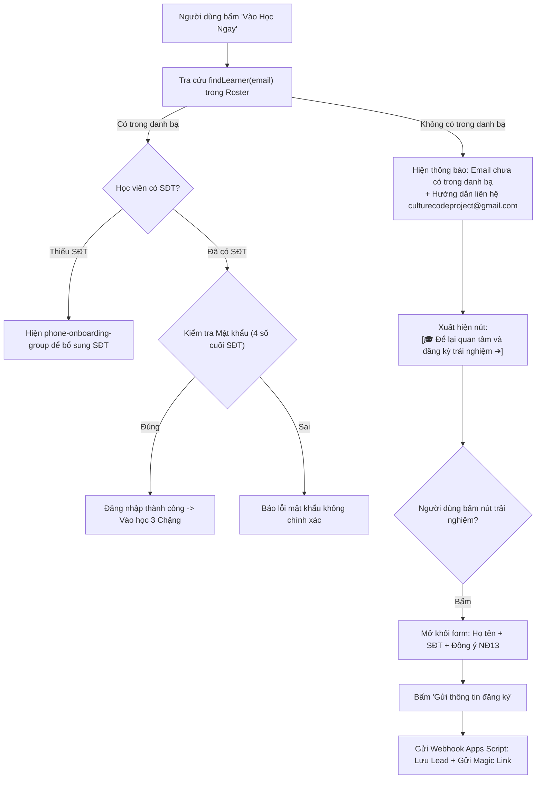

# KẾ HOẠCH TRIỂN KHAI: TỐI ƯU HÓA CỔNG ĐĂNG NHẬP & PHÂN LUỒNG THU THẬP LEAD TRẢI NGHIỆM

- **Mã kế hoạch**: `PLAN-20261004-LOGIN-GATE-AND-LEAD-CAPTURE`
- **Ngày lập**: 04/10/2026
- **Trạng thái**: Chờ phê duyệt Cấp độ 2 (Awaiting Plan Approval)
- **Hệ thống áp dụng**: Delivering Happiness Blended Learning LMS Engine

---

## 1. NGUỒN CHUẨN (SOURCE OF TRUTH) & YÊU CẦU NGƯỜI DÙNG

1. **Yêu cầu chỉ đạo từ Sếp**:
   - Dừng ở phiên bản hiện tại, không thực hiện quay lui (rollback).
   - Kiểm tra và tái cấu trúc lại logic chặn đăng nhập:
     * **Mặc định**: Chỉ xuất hiện ô **Email** và ô **Mật khẩu (Password)** cùng nút Đăng nhập ("Vào Học Ngay"). Tuyệt đối không tự ý ẩn ô mật khẩu hoặc bung form học thử khi người dùng đang gõ email.
     * **Khi không tìm thấy Email** (sau khi bấm Đăng nhập và tra cứu danh bạ không có): Mới xuất hiện nút **"Để lại quan tâm và đăng ký trải nghiệm"**.
     * Khi nhấn nút này, mở khối yêu cầu nhập thông tin (Họ và tên, Số điện thoại, Email đã có sẵn) để lưu thông tin vào Lead qua Webhook CRM và gửi liên kết trải nghiệm Chặng 1.

---

## 2. DANH MỤC TỆP TRONG PHẠM VI (ALLOWLIST)

1. `C:\Users\vu.hoang\.gemini\antigravity\scratch\Teaching DH\dhm-micro-lms\index.html`
2. `C:\Users\vu.hoang\.gemini\antigravity\scratch\Teaching DH\dhm-micro-lms\app.js`
3. `C:\Users\vu.hoang\.gemini\antigravity\scratch\dh4hn-website\lms\index.html` (Bản đồng bộ triển khai)
4. `C:\Users\vu.hoang\.gemini\antigravity\scratch\dh4hn-website\lms\app.js` (Bản đồng bộ triển khai)

---

## 3. RANH GIỚI AN TOÀN & ĐIỀU KIỆN DỪNG (BOUNDARIES & STOP CONDITIONS)

- **Phạm vi can thiệp**: Chỉ tinh chỉnh logic hiển thị Modal đăng nhập (`#auth-modal`), sự kiện kiểm tra Email (`findLearner`), nút kích hoạt form Lead (`#btn-show-trial-lead`), và gửi webhook thu thập lead (`register_or_request_link`).
- **Giữ nguyên**: Không thay đổi CSDL danh bạ học viên (`master_learners_roster.json`), logic phân quyền vượt chặng (`isStageUnlocked`), nội dung giáo trình (`curriculum_data.json`) hoặc hệ thống khóa cứng Chặng 2 & 3 đối với tài khoản học thử.
- **Bảo toàn**: Tạo bản sao lưu `.bak_20261004_login_gate` trước khi ghi đè, đọc lại UTF-8 explicit sau khi chỉnh sửa.

---

## 4. CHI TIẾT KỸ THUẬT & THIẾT KẾ GIAO DIỆN (SPECIFICATION)

### A. Giao diện Mặc định (Default State)
- Ô `Email học viên đã đăng ký`: `<input type="email" id="login-identity">`
- Ô `Mật khẩu truy cập`: `<input type="password" id="login-password">` (kèm nút mắt Hiện/Ẩn mật khẩu)
- Nút bấm chính: `<button type="submit" id="btn-submit-auth">Vào Học Ngay ➔</button>`
- Ẩn hoàn toàn: `#phone-onboarding-group`, `#btn-show-trial-lead`, `#trial-onboarding-group`, `#auth-error-banner`.

### B. Loại bỏ hiện tượng nhảy giao diện khi gõ Email
- Gỡ bỏ logic tự động ẩn `#password-group` và tự bung `#trial-onboarding-group` trong sự kiện `loginIdentityInput.addEventListener("input")`.
- Khi người dùng đang gõ: giữ nguyên ô mật khẩu để người dùng nhập mật khẩu bình thường. Nếu người dùng sửa đổi email sau khi có lỗi, tự động ẩn banner lỗi và ẩn nút lead.

### C. Phân luồng khi nhấn Submit ("Vào Học Ngay")


### D. Nút và Khối Form Thu Thập Lead
- Nút xuất hiện khi không tìm thấy email:
  ```html
  <div id="trial-trigger-wrapper" class="hidden pt-2">
      <button type="button" id="btn-show-trial-lead" class="w-full py-2.5 px-4 rounded-xl bg-amber-500/15 border border-brand-amber/40 hover:bg-amber-500/25 text-brand-amber font-bold text-xs transition-all flex items-center justify-center gap-2">
          <span>🎓</span>
          <span>Để lại quan tâm và đăng ký trải nghiệm</span>
          <span>➔</span>
      </button>
  </div>
  ```
- Khối form nhập thông tin (hiện khi bấm nút trên):
  + Tự động gắn email người dùng đã gõ.
  + Nhập Họ và tên (`#trial-name`).
  + Nhập Số điện thoại 10 số (`#trial-phone`).
  + Checkbox đồng ý theo NĐ 13/2023/NĐ-CP (`#trial-consent`).
  + Nút gửi: `#btn-request-trial` ("Gửi Thông Tin & Nhận Liên Kết Học Thử").

---

## 5. KẾ HOẠCH KIỂM CHỨNG (VERIFICATION PLAN)

1. **Kiểm thử Trạng thái Mặc định (Default State Test)**:
   - Mở màn hình đăng nhập: chỉ thấy Email, Mật khẩu và nút "Vào Học Ngay".
   - Gõ email bất kỳ: ô Mật khẩu KHÔNG bị biến mất, form học thử KHÔNG tự ý bung ra.
2. **Kiểm thử Đăng nhập Học viên Hợp lệ (Valid Learner Test)**:
   - Nhập email có trong danh bạ (ví dụ: `hoanhn.edu.vn@gmail.com`) + 4 số cuối SĐT `3505`.
   - Bấm "Vào Học Ngay": đăng nhập thành công vào giao diện học tập.
3. **Kiểm thử Nhập Sai Mật khẩu (Wrong Password Test)**:
   - Nhập email hợp lệ + mật khẩu sai: báo lỗi mật khẩu, không bung nút lead.
4. **Kiểm thử Email Ngoài Danh Bạ (Non-Roster Email Test)**:
   - Nhập `nguoila@gmail.com` + mật khẩu bất kỳ và bấm "Vào Học Ngay".
   - Hệ thống báo: Email chưa có trong danh sách học viên chính thức.
   - Xuất hiện nút: **"Để lại quan tâm và đăng ký trải nghiệm"**.
   - Bấm nút: form nhập Họ tên + Số điện thoại xuất hiện mượt mà.
   - Nhập Họ tên, SĐT và bấm gửi: dữ liệu được gửi thành công về Webhook CRM và hiển thị thông báo phản hồi.
5. **Kiểm thử Tính toàn vẹn Cú pháp (Syntax & Lint Check)**:
   - Chạy `node -c app.js` kiểm tra không có lỗi cú pháp JavaScript.
   - Kiểm tra mã hóa UTF-8 toàn vẹn sau khi ghi.
